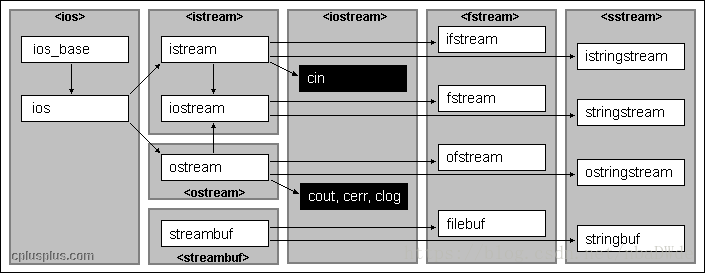

## c++I/O

c++通过标准库I/O流实现I/O操作。预定义了6个流 **对象 **，为：

+   `istream` <- `std::cin`/`std::wcin`，对应标准输入的输入流；
+   `ostream` <- `std::cout`/`std::wcout`，对应标准输出的输出流；
+   `ostream` <- `std::cerr`/`std::wcerr`，对应标准错误的输出流。

c语言中，把所有设备当作文件，FILE变量是一个适合存储所有**文件流**信息的对象类型。

c++则不同，使用oop思想，ios是基础类，istream和otream都是继承自它。

