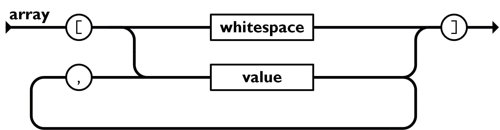

Json官网：http://www.json.org/json-zh.html

json中仅支持两种结构：

+ name->value键值对（pair）的集合，一般称为对象（object）。
+ 值的有序表，一般称为数组(array)。
1. pair
先从键值对（pair）开始，一个pair的通常结构是：`string:value`
键值之间的对应关系使用`:`表示，左边的为name，右边的为value。
一般key使用字符串，当然也可以使用数字，但是不推荐。
value的取值就比较随便，可以是任何任何json支持的类型（比如object，array，string，number，true/false，null等）。

2. object
object可以认为是多个pair的集合，官网上给出的示意图如下：

其语法是以{作为object开始，以}作为object结束，不同的pair之间使用,分割。
需要说明的是object中的数据存储是无序的。

下面是一个比较典型的object构成
```json
{
"name" : "tocy",
"age" : 1000
}
```
3. array
array是value的有序集合。先看官网上针对array结构的示意图：

其语法是以[作为array起始，以]作为array结束，array元素之间使用,分割。
实际使用中建议在array中使用统一的类型，否则解析起来会麻烦点。
比如下面语法是合法的：
```json
[{"name":"tocy"}, {"age":1000}, {"domain":"cn"}]
```
当然下面这种写法也是可以的，`[1, "ts", true, {"key":45}]`

至于其他的string和number支持的格式，建议参考json官方介绍。