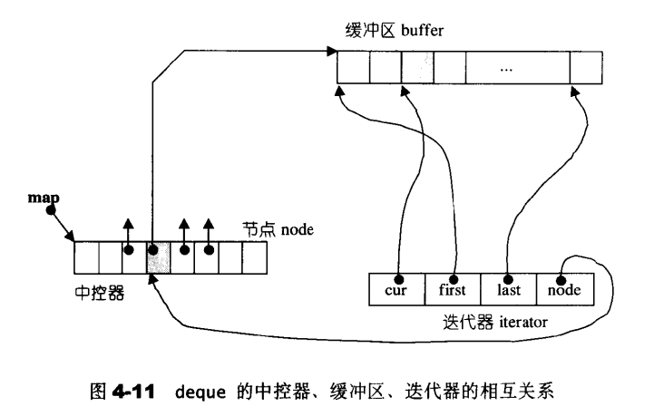

## C++序列式容器（STL序列式容器）

序列容器，即以线性排列（类似普通数组的存储方式）来存储某一指定类型（例如 int、double 等）的数据。包括：
+ vector<T> (数组)
+ deque<T>（双端队列容器）
+ list<T>（链表容器）
+ forward_list<T>（正向链表容器）

### array容器

| 成员函数  | 功能                                                         |
| --------- | ------------------------------------------------------------ |
| begin()   | 返回指向容器中第一个元素的正向迭代器；如果是 const 类型容器，在该函数返回的是常量正向迭代器。 |
| end()     | 返回指向容器最后一个元素之后一个位置的正向迭代器；如果是 const 类型容器，在该函数返回的是常量正向迭代器。此函数通常和 begin() 搭配使用。 |
| rbegin()  | 返回指向最后一个元素的反向迭代器；如果是 const 类型容器，在该函数返回的是常量反向迭代器。 |
| rend()    | 返回指向第一个元素之前一个位置的反向迭代器。如果是 const 类型容器，在该函数返回的是常量反向迭代器。此函数通常和 rbegin() 搭配使用。 |
| cbegin()  | 和 begin() 功能类似，只不过其返回的迭代器类型为常量正向迭代器，不能用于修改元素。 |
| cend()    | 和 end() 功能相同，只不过其返回的迭代器类型为常量正向迭代器，不能用于修改元素。 |
| crbegin() | 和 rbegin() 功能相同，只不过其返回的迭代器类型为常量反向迭代器，不能用于修改元素。 |
| crend()   | 和 rend() 功能相同，只不过其返回的迭代器类型为常量反向迭代器，不能用于修改元素。 |

成员函数功能如下：


rbegin()/rend()为反向迭代器，使用反向迭代器进行 ++ 或 -- 运算时，++ 指的是迭代器向左移动一位，-- 指的是迭代器向右移动一位

### vector容器

vector与array类似，array 实现的是静态数组（容量固定的数组），而 vector 实现的是一个动态数组。

vector容器包含的成员函数：

| 函数成员         | 函数功能                                                     |
| ---------------- | ------------------------------------------------------------ |
| begin()          | 返回指向容器中第一个元素的迭代器。                           |
| end()            | 返回指向容器最后一个元素所在位置后一个位置的迭代器，通常和 begin() 结合使用。 |
| rbegin()         | 返回指向最后一个元素的迭代器。                               |
| rend()           | 返回指向第一个元素所在位置前一个位置的迭代器。               |
| cbegin()         | 和 begin() 功能相同，只不过在其基础上，增加了 const 属性，不能用于修改元素。 |
| cend()           | 和 end() 功能相同，只不过在其基础上，增加了 const 属性，不能用于修改元素。 |
| crbegin()        | 和 rbegin() 功能相同，只不过在其基础上，增加了 const 属性，不能用于修改元素。 |
| crend()          | 和 rend() 功能相同，只不过在其基础上，增加了 const 属性，不能用于修改元素。 |
| size()           | 返回实际元素个数。                                           |
| max_size()       | 返回元素个数的最大值。这通常是一个很大的值，一般是 232-1，所以我们很少会用到这个函数。 |
| resize()         | 改变实际元素的个数。                                         |
| capacity()       | 返回当前容量。                                               |
| empty()          | 判断容器中是否有元素，若无元素，则返回 true；反之，返回 false。 |
| reserve()        | 增加容器的容量。                                             |
| shrink _to_fit() | 将内存减少到等于当前元素实际所使用的大小。                   |
| operator[ ]      | 重载了 [ ] 运算符，可以向访问数组中元素那样，通过下标即可访问甚至修改 vector 容器中的元素。 |
| at()             | 使用经过边界检查的索引访问元素。                             |
| front()          | 返回第一个元素的引用。                                       |
| back()           | 返回最后一个元素的引用。                                     |
| data()           | 返回指向容器中第一个元素的指针。                             |
| assign()         | 用新元素替换原有内容。                                       |
| push_back()      | 在序列的尾部添加一个元素。                                   |
| pop_back()       | 移出序列尾部的元素。                                         |
| insert()         | 在指定的位置插入一个或多个元素。                             |
| erase()          | 移出一个元素或一段元素。                                     |
| clear()          | 移出所有的元素，容器大小变为 0。                             |
| swap()           | 交换两个容器的所有元素。                                     |
| emplace()        | 在指定的位置直接生成一个元素。                               |
| emplace_back()   | 在序列尾部生成一个元素。                                     |

+   size()和capacity()的区别：size为vector已分配元素的个数，capacity()为vector分配的空间的大小

+   push_back(),emplace_back()：相同，用emplace_back()

+   insert(),emplace()：emplace() 每次只能插入一个元素，但效率更高，

    #### insert()

| 语法格式                        | 用法说明                                                     |
| ------------------------------- | ------------------------------------------------------------ |
| iterator insert(pos,elem)       | 在迭代器 pos 指定的位置之前插入一个新元素elem，并返回表示新插入元素位置的迭代器。 |
| iterator insert(pos,n,elem)     | 在迭代器 pos 指定的位置之前插入 n 个元素 elem，并返回表示第一个新插入元素位置的迭代器。 |
| iterator insert(pos,first,last) | 在迭代器 pos 指定的位置之前，插入其他容器（不仅限于vector）中位于 [first,last) 区域的所有元素，并返回表示第一个新插入元素位置的迭代器。 |
| iterator insert(pos,initlist)   | 在迭代器 pos 指定的位置之前，插入初始化列表（用大括号{}括起来的多个元素，中间有逗号隔开）中所有的元素，并返回表示第一个新插入元素位置的迭代器。 |

##### 		删除元素

| 函数                  | 功能                                                         |
| --------------------- | ------------------------------------------------------------ |
| pop_back()            | 删除 vector 容器中最后一个元素，该容器的大小（size）会减 1，但容量（capacity）不会发生改变。 |
| erase(pos)            | 删除 vector 容器中 pos 迭代器指定位置处的元素，并返回指向被删除元素下一个位置元素的迭代器。该容器的大小（size）会减 1，但容量（capacity）不会发生改变。 |
| swap(beg)、pop_back() | 先调用 swap() 函数交换要删除的目标元素和容器最后一个元素的位置，然后使用 pop_back() 删除该目标元素。 |
| erase(beg,end)        | 删除 vector 容器中位于迭代器 [beg,end)指定区域内的所有元素，并返回指向被删除区域下一个位置元素的迭代器。该容器的大小（size）会减小，但容量（capacity）不会发生改变。 |
| remove()              | 删除容器中所有和指定元素值相等的元素，并返回指向最后一个元素下一个位置的迭代器。值得一提的是，调用该函数不会改变容器的大小和容量。 |
| clear()               | 删除 vector 容器中所有的元素，使其变成空的 vector 容器。该函数会改变 vector 的大小（变为 0），但不是改变其容量。 |

##### 		删去多余的容量

shrink_to_fit() ：将当前 vector 容器的容量缩减至和实际存储元素的个数相等。

swap()：vector<T>(x).swap(x);

```c++
vector<int>myvector;
myvector.reserve(1000);
vector<int>(myvector).swap(myvector);
```

## 容器分类

stl中容器以及其中的相互关系


### vector

vector底层是连续的内存

vector的迭代器是指针，两个迭代器start，finsh指向目前正在被使用连续空间的头部和尾部 还有一个end指向空间中可用部分的最后。

扩容后，原所有的迭代器都失效了。

### list

list是链表，随机插入和删除时间常数为n。list为双向链表。

list的迭代器不是普通指针，list的插入和删除不会导致原有的迭代器失效，erase只会导致指向被删除的迭代器失效，其他不受影响。

模板定义的时候重载了运算符：==，！=，*，->，++，--，++（n），--（n）。

list是环状双向链表。end为特意置于尾部的一个空白节点。以此实现empty() ,end(),begin(),front(),back()等方法。


list中insert（）方法被重载，并且有多种形式。

list不能使用stl，因为stl的sort()只支持RandomAccessIterator（）。

### deque

deque为双端队列，支持头尾插入和删除。deque

deque没有容量的概念，他动态的以分段连续空间构成，但随之的，其迭代器不是普通指针，所以除非必要，最好用vector不用deque。

对deque排序的时候，可以先复制到一个vector上进行排序，然后再复制会deque。

deque有一个中央控制器。迭代器前进后退都较为繁琐。

deque使用一块“map“（非stl的map）作为主控，map为一连续空间。每个元素都是指针，指向另一端（较大的）连续线性空间，称为缓存区，。缓冲区为deque的存储主题。默认大小为512bytes（stl允许自定义）**缓冲区的大小是固定的**。


list的iterator没有继承std::iterator，需要自定义iterator的五类数据:

```c++
typedef random_access_iterator_tag_ iterator_category;
typedef T value_type;
typedef Ptr pointer;
typedef Ref reference;
typedef ptrdiff_t difference_type;//两指针差
```

同时迭代器需要由指向中控的指针，指向缓冲区的头，尾，当前元素。

缓冲区size可以由用户定义，如果未定义，则size()=sizeof(value_type>512?1:512/sizeof(value_type)

deque的中控器，缓冲区和迭代器的关系：




deque重载运算符：*，->，-，++，++（n），--，--（n），+=（n），+（n），-=，-（n），[]，==，！=，<

##### deque的数据结构

deque维护了一指向中控map的指针，start，finsh指向当前缓冲区头尾的指针，当前map的大小，
