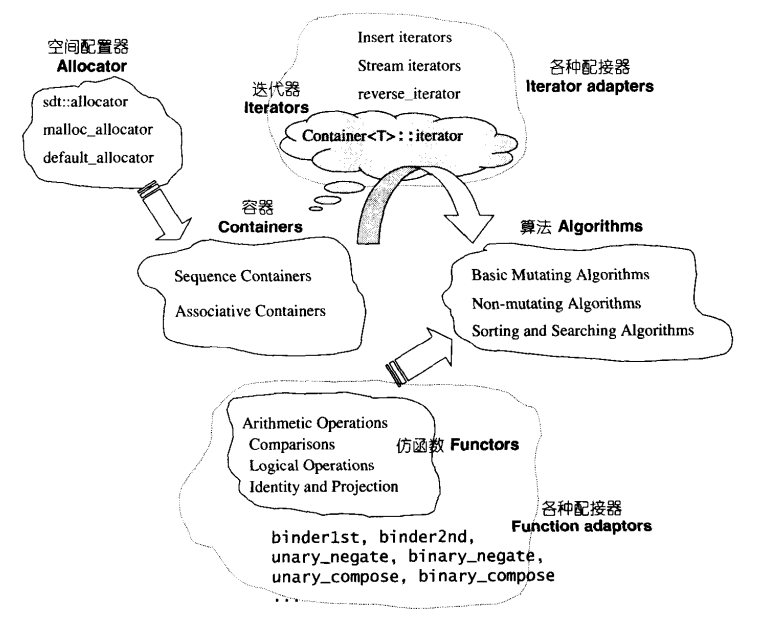

## 概论

参考《STL源码剖析》 

####  六大组件

1. 容器 containers

   如vector，list，deque，set，map

2. 算法 algorithms

   如 sort，search，copy，erase

3. 迭代器 iterators

   操作符：*,->,++,--等

4. 仿函数 functors

   重载了operator().函数指针可以视为狭义的仿函数

5. 配接器 adapters

6. 配置器 allocators

   负责空间配置和管理                
   六大组件关系：

   
