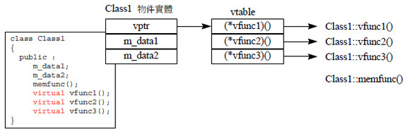
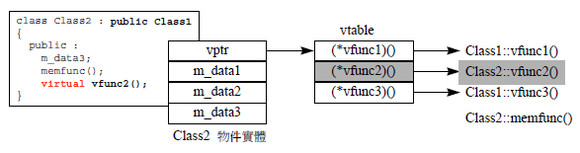

# 虚函数

#### 什么是虚函数？

虚函数就是在普通函数前面加了virtual关键字。

声明时要加virtual，定义时不用加。

虚函数的作用==》用指针/引用调用时会发生**动态的绑定**(多态)。

#### 多态

多态分为静态多态和动态多态，函数重载和运算符重载属于静态多态，动态多态通过虚函数实现。

#### 虚函数

（1）有了虚函数，会产生一个虚函数指针。

（2）一个类中有无数多个虚函数都只会产生一个虚函数指针，虚指针指向虚函数表。

（3）虚函数指针的优先级最高，在内存布局中在最前面。

（4）派生类的虚函数要用public，访问限定只在编译时起作用，虚函数是动态绑定，运行时才确定

### 虚函数表

每个含有虚函数的类有一张虚函数表(vtbl)，表中每一项是一个虚函数的地址， 也就是说，虚函数表的每一项是一个虚函数的指针。

   

虚函数表在编译期间产生，存放在只读数据段，生存周期从程序开始到程序结束。

多重继承多多个虚函数表，每个父类一个虚表

##### 生成虚函数的条件

因为虚函数表中存放的时虚函数的地址 -->  因此虚函数一定要能取地址

因为虚函数指针存在于对象中  -->  因此虚函数要用对象来调用

哪些函数能成为虚函数？

1）构造函数      --> 不能成为虚函数，因为对象还未生成。

2）析构函数      --> 可以成为虚函数，满足上面两条。(析构函数最好是虚函数，这样不易造成内存泄漏)

3）静态成员方法   --> 不可以成为虚函数，因为不依赖于对象的调用。

4）内联函数       =》不可以成为虚函数，因为不能取地址。
