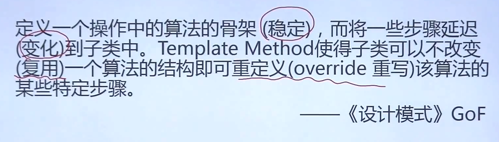
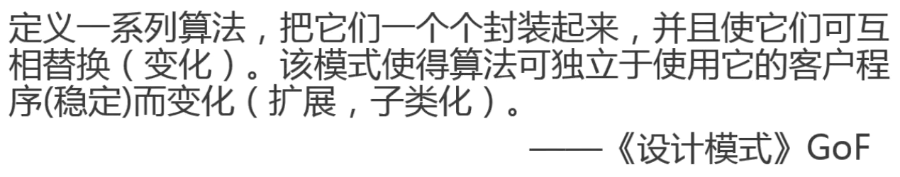
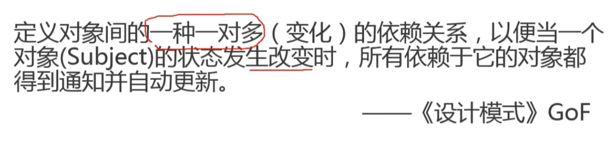
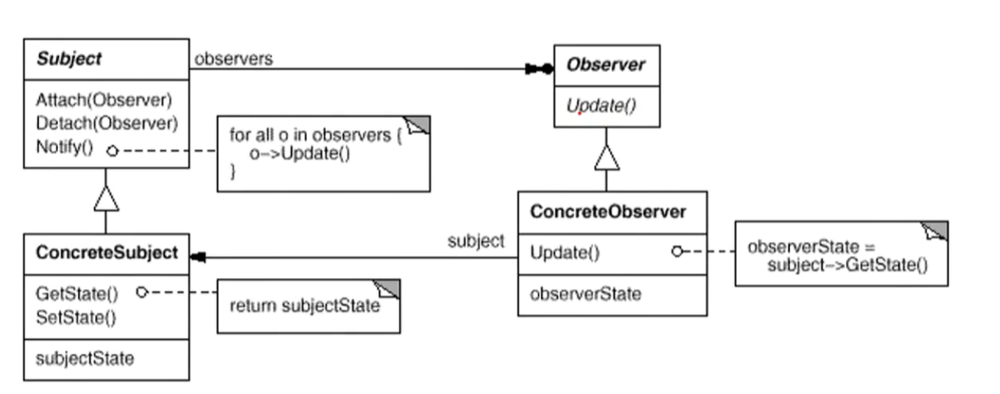

# 设计模式


在变化和稳定中寻找隔离点，从而分离他们

设计原则：

| 1    | 开放封闭原则  | 面向扩展开放，面向修改关闭                                   |
| ---- | ------------- | ------------------------------------------------------------ |
| 2    | 里氏转换原则  | 超类存在的地方，子类是可以替换的                             |
| 3    | 依赖倒转原则  | 实现尽量依赖抽象，不依赖具体实现                             |
| 4    | 组合/聚合原则 | 要尽量使用合成/聚合达到复用，而不是继承关系达到复用的目的。  |
| 5    | 接口隔离原则  | 应当为客户端提供尽可能小的单独的接口，而不是提供大的总的接口 |
| 6    | “迪米特”法则  | 又叫最少知识原则，一个软件实体应当尽可能少的与其他实体发生相互作用 |
| 7    | 单一职责原则  | 每一个类应该专注于做一件事情                                 |

## 创建型

### 单例

## 组件协作模式

### 模板方法 Template Method



+ template method是非常常用的设计模式，利用虚函数的多态，提供灵活的拓展点。

+ 定义一个操作中的骨架，将一些步骤实现推迟到子类中（vitual），利用虚函数多态，晚绑定 

+ 具体实现里，虚方法可以实现也可以不实现，推荐设置为protected方法

### 策略模式 Strategy



+ 与工厂模式相结合

  ```c++
  class TaxStrategy{
      public:
      virtual double Calculate(const Context& context)=0;
      virtual ~TaxStrategy();
  }
  class CNTax:public TaxStrategy{
      public:
      virtual double Calcuclate(const Context& context){
          //*****
      }
  }
  class SalesOrder{
      private:
      TaxStragegy* strategy;//用指针，多态，利用工厂模式创建
      SalesOrder(StrategyFactory* strategyFactory){
          this->strategy= strategyFactory->NewStrategy();//堆对象
      }
      ~SalesOrder(){
          delete this->strategy;
      }
      public double CalculateStrategy(){
           Context context();
          double val=strategy->Calculate(context);//多态
      }
  }
  ```

  

+ 含有许多条件判断语句的代码可以考虑使用Strategy模式
+ if else不被使用的代码端，可能无法放进cpu的cache中/浪费cache容量

+ 如果Strategy对象没有实例变量，上下文可以共享同一个Strategy对象，从而节省对象开销

###  观察者模式 Observer/Event

 



```c++
class IProgress{
public:
    virtual void DoProgress(float value)=0;
    virtual ~IProgress(){};
}；
class FileSplitter{
    string m_filepath;
    int m_fileNumber;
    List<IProgress*> m_iprogressVector;//机制
public:
    FileSplitter(const string& filePath,int filename):
    	m_filepath(filePath),
    	m_fileNumber(filename){
            
        }
	void add_IProgress(IProgress* iprogress){
        m_iprogressVector.pusg_back(iprogress);
    }
    
    void remove_IProgress(IProgress* iprogress){
        m_iprogressVector.remove(iprogress);
    }
	void split(){
        //read big file
        //write to small file
        for(int i=0;i<m_fileNumber;i++){
            //..
            if(m_iprogress!=nullptr){
                float value=(i+1)/m_fileNumber;
               onProgress(value);
            }
        }
    }
protected:
    virtual void onProgress(float value){
        auto itor=m_iprogressVector.begin();
        //..
        while(itor!=m_iprogressVector.end()){
            (*itor)->DoProgress(value);//更新进度条
            itor++;
        }
        
    }
}
class MainForm:public Form,public IProess{//多继承少用，但可以一个父类，多个接口，
    TextBox* txtFilePath;
    TextBox* txtFileNumber;
    ProgressBar* progressBar;
public:
    virtual void DoProgress(float value){//重写
        progressBar->setvalue(value);
    }
    void Button1_click(){
        string filePath=txtFilePath->getText();
        int number=atoi(txtFileNumber->getText().c_str());
        FileSplitter splitter(filePath,number,this);
        splitter.split();
    }
}
```

+ 把发送通知对象抽象出来变成发送通知机制，这样发送者无需指定发送者，而是对发送机制发送通知，通知会自动传播
+ 观察者自己决定是否订阅通知，目标对此一无所知
##  单一职责模式

### 装饰模式 Decorator


