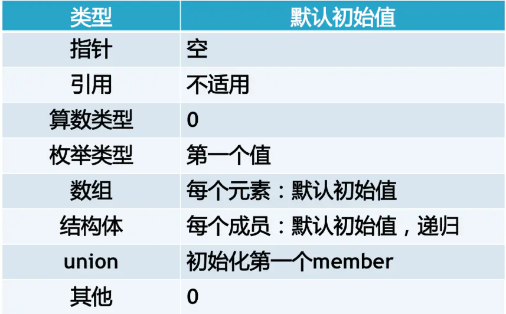

## 静态成员

静态成员变量是一种特殊的成员变量，它被关键字`static`修饰。`static` 成员变量属于类，不属于某个具体的对象，即使创建多个对象，也只分配一份内存。

+   静态成员变量必须在类声明的外部初始化，具体形式为：

```c++
type class::name = value;
```

type 是变量的类型，class 是类名，name 是变量名，value 是初始值。

静态成员变量的内存既不是在声明类时分配，也不是在创建对象时分配，而是在（类外）初始化时分配。反过来说，没有在类外初始化的静态成员变量不能使用。

静态成员变量不占用对象的内存，而是在所有对象之外开辟内存，即使不创建对象也可以访问。

+   静态成员变量既可以通过对象，对象指针来访问，也可以通过类来访问。

+   静态变量初始化时可以赋初值，也可以不赋值。如果不赋值，那么会被默认初始化为 0。全局数据区的变量都有默认的初始值 0，而动态数据区（堆区、栈区）变量的默认值是不确定的，一般认为是垃圾值。

+   初始化：

+   这些特殊类型的成员变量主要有：

    1.   引用

    2.   常量

    3.   静态变量

    4.   静态整型常量

    5.   静态非整型常量

    对于1. 引用和2. 常量，成员变量必须通过构造函数的参数列表的方式初始化。

    对于3. 静态变量，static成员变量需要在类定义体外进行初始化与定义，因为static数据成员独立该类的任意对象存在，它是与类关联的对象，不与类对象关联。

    对于4. 静态整型常量，该类型成员可以直接在类中初始化，也可以在类中声明，在类定义体外进行定义。

    对于5. 静态非整型常量，该类型也是可以在类中声明在类定义体外进行定义，或者直接在类中定义初始化。

+ 静态变量的初始化顺序：在同一个编译单元内，静态变量初始化的顺序就是定义的顺序，跨编译单元的静态变量的初始化顺序未定义！

    


## 静态成员函数

+   普通成员函数可以访问所有成员（包括成员变量和成员函数），静态成员函数只能访问静态成员。

    ​	静态成员函数与普通成员函数的根本区别在于：普通成员函数有 this 指针，可以访问类中的任意成员；而静态成员函数没有 this 指针，只能访问静态成员（包括静态成员变量和静态成员函数）。

