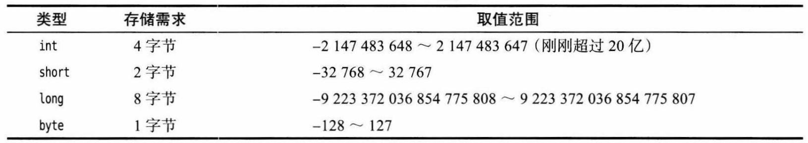
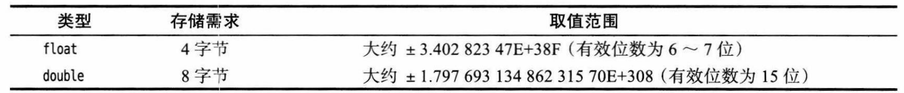
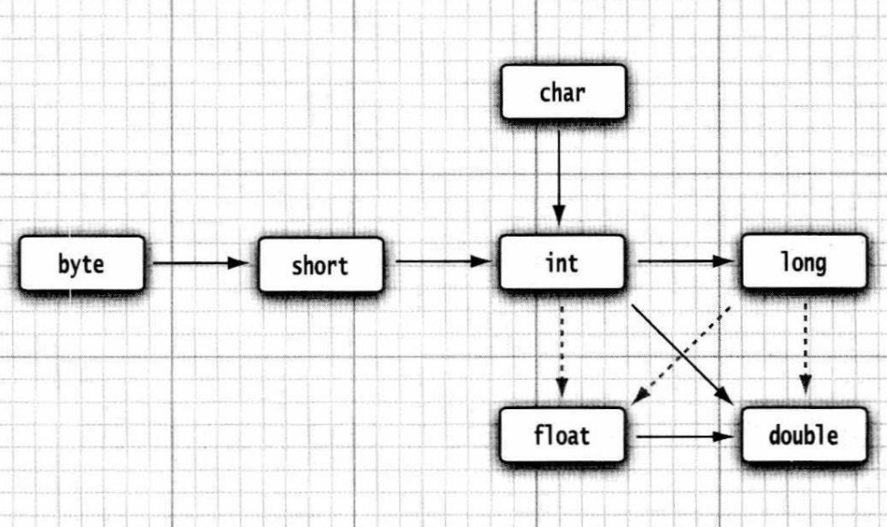
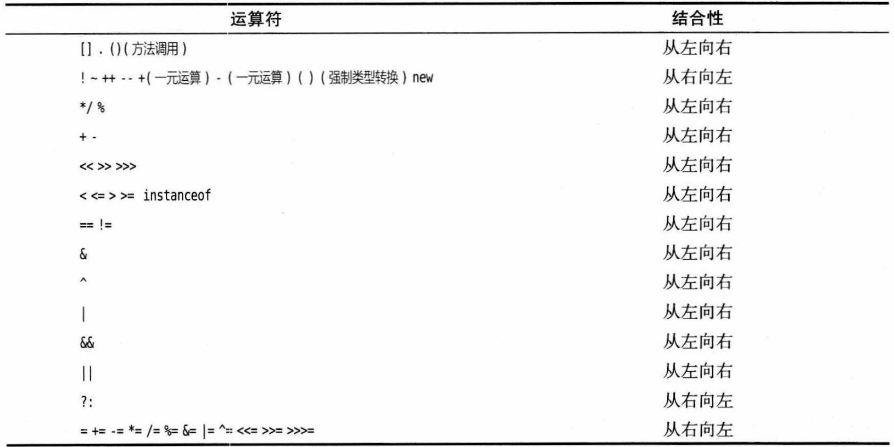

## Java基础数据类型

java有8种数据类型：int,short,byte,long,double,float,char,boolean



+ 数字前加  `0b`、`0B`表示二进制

+ 可以在数字之中加_  `1_000_000`为一百万



+ 数字后加`f`或者`F`表示flout，默认小数为`double float`类型

    ```java
    Double.POSITIVE_INFINITY    =1.0/0 正溢出
    Double.NEGATIVE_INFINITY	=-1.0/0 负溢出
    Double.NaN					=0.0/0	不是数字
    ```

+ 注释中的`\u`会转为换行符，\u被认为是Unicode码

+ 合法的类型转换：实线无精度损失，虚线为可能损失精度

    

+ float转int丢失小数部分，如果想要四舍五入，则用`Math.round`方法

## 常量与变量

+ 变量申明后必须被初始化

+ 用`final`修饰常量，只能被赋值一次，相当于`const`，常量一般全大写

    ```java
    final double PI=3.14;
    ```

+ 用`static final `修饰类常量，在一个类的多个方法中可以被使用

+ 枚举：

    ```java
    enum Size={SMALL,MEDIUM,LARGE};
    Size s=Size.MEDIUM;
    ```

不必再数学方法前加`Math.`,而是在源文件下加上`import static java.lang.Math.*`


## 运算符

位运算符：

```java
&  与  |  或  ^  异或  ~  反
```

\>\>表示右移，如果该数为正，则高位补0，若为负数，则高位补1；（数据类型默认为byte-8位）
正数：r = 20 >\> 2

　　20的二进制补码：0001 0100

　　向右移动两位后：0000 0101

　　　　　　　结果：r = 5

负数：r = -20 \>\> 2

　　-20 的二进制原码 ：1001 0100

　　-20 的二进制反码 ：1110 1011

　　-20 的二进制补码 ：1110 1100 

　　右移两位后的补码：1111 1011 

　　　　　　　　反码：1111 1010

　　　　　　　　原码：1000 0101

　　　　　　　　结果：r = -5

\>\>\>表示无符号右移，也叫逻辑右移，即若该数为正，则高位补0，而若该数为负数，则右移后高位同样补0

正数：　r = 20 >\>\> 2

　　　　的结果与 r = 20 \>\> 2 相同；

负数：　r = -20 \>\>\> 2

注：以下数据类型默认为int 32位

　　-20:源码：10000000 00000000 00000000 00010100

　　　　反码：11111111  11111111   11111111   11101011

　　　　补码：11111111  11111111   11111111   11101100

　　　　右移：00111111  11111111   11111111   11111011

　　　　结果：r = 1073741819

+ 优先级：

+ **==**和**equals**

    **==：**

    1、比较的是操作符两端的操作数是否是同一个对象。

    2、两边的操作数必须是同一类型的（可以是父子类之间）才能编译通过。

    3、比较的是地址，如果是具体的阿拉伯数字的比较，值相等则为true，如：

    int a=10 与 long b=10与 double c=10.0都是相同的（为true），因为他们都指向地址为10的堆。

    **equals：**

    equals用来比较的是两个对象的内容是否相等，由于所有的类都是继承自java.lang.Object类的，所以适用于所有对象，如果没有对该方法进行重写的话，调用的仍然是Object类中的方法，而Object中的equals方法返回的却是==的判断。

+ `String a="abc"`和`String b=new String("hello");`a在字符串缓冲池中，b在堆中，基本 数据类型在栈中，所以`s1==s2`为`false` `s1.equals(s2)`为`true`