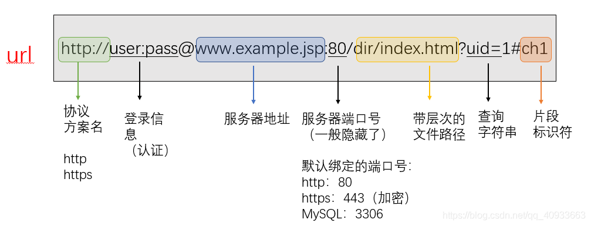
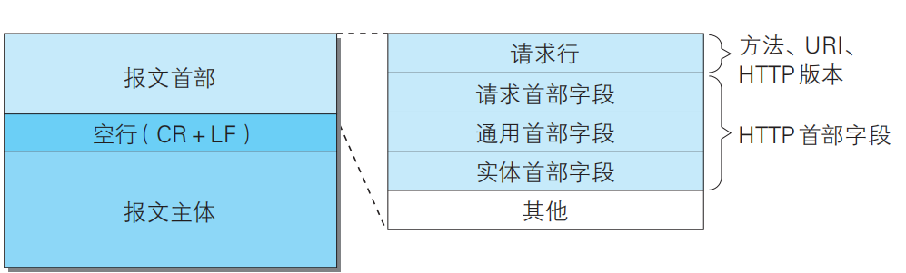
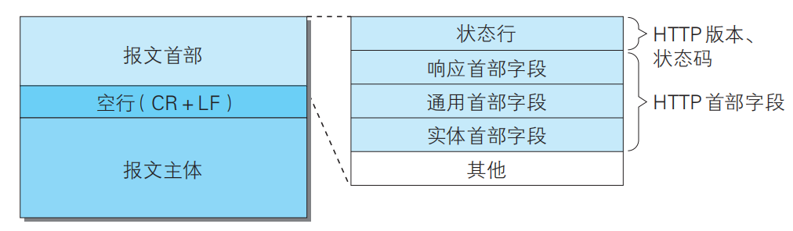

## 	HTTP

#### 简单的 HTTP协议




HTTP的请求包括：请求行(request line)、请求头部(header)、空行 和 请求数据 四个部分组成。


chrome抓包例子：

```http
:authority: www.cnblogs.com
:method: GET
:path: /loberty/ajax/blogStats
:scheme: https
accept: text/plain, */*; q=0.01
accept-encoding: gzip, deflate, br
accept-language: zh-CN,zh;q=0.9
cookie: _ga=GA1.2.1333420690.1641443936; _gid=GA1.2.1907258855.1642305405; .AspNetCore.Antiforgery.b8-pDmTq1XM=CfDJ8GsLOKiGtk1Au0UP1SouGdUXpEkTm1nRhOPzPL3TVzrK0Y8hOMSFDoIcNDjtvf7JkP6wXDJog0ohJbj6fRzqsiiqFHkNqWRLIjpmQ2hWQ01PJO7P4CrnIygKgr6Yc-LAhnoN08bN2SNaqcDWRJUg-4s; Hm_lvt_866c9be12d4a814454792b1fd0fed295=1642348403,1642348405,1642348425,1642348447; Hm_lpvt_866c9be12d4a814454792b1fd0fed295=1642348447
referer: https://www.cnblogs.com/loberty/p/11990576.html
sec-ch-ua: " Not;A Brand";v="99", "Google Chrome";v="97", "Chromium";v="97"
sec-ch-ua-mobile: ?0
sec-ch-ua-platform: "Windows"
sec-fetch-dest: empty
sec-fetch-mode: cors
sec-fetch-site: same-origin
user-agent: Mozilla/5.0 (Windows NT 10.0; Win64; x64) AppleWebKit/537.36 (KHTML, like Gecko) Chrome/97.0.4692.71 Safari/537.36
x-requested-with: XMLHttpRequest
```

1. 请求行

`GET`为请求类型，`/mix/76.html?name=kelvin&password=123456`为要访问的资源`URI`，`HTTP/1.1`是协议版本

2. 请求头部

从第二行起为请求头部，`Host`指出请求的目的地（主机域名）；`User-Agent`是客户端的信息，它是检测浏览器类型的重要信息，由浏览器定义，并且在每个请求中自动发送。

3. 空行

请求头后面必须有一个空行

4. 请求数据

请求的数据也叫请求体，可以添加任意的其它数据。

##### 常用方法：

1. GET

    请求URI识别的资源，指定的资源经服务

    器端解析后返回响应内容。

2. POST

    传输实体的主体，

    一般url限制在2k，get能传输的有限

    GET产生一个TCP数据包；POST产生两个TCP数据包，POST先发head再发data

    GET请求只能进行url编码，而POST支持多种编码方式。

    GET请求参数会被完整保留在浏览器历史记录里，而POST中的参数不会被保留。

    GET比POST更不安全，因为参数直接暴露在URL上，所以不能用来传递敏感信息。

    对参数的数据类型，GET只接受ASCII字符，而POST没有限制。

3. PUT

    PUT 方法用来传输文件

4. HEAD

    HEAD 方法和 GET 方法一样，只是不返回报文主体部分。用于确认

    URI 的有效性及资源更新的日期时间等。

5. DELETE

    DELETE 方法用来删除文件，是与 PUT 相反的方法。

6. CONNECT

    方法要求在与代理服务器通信时建立隧道，实现用隧道

    协议进行 TCP 通信。主要使用 SSL和TLS

​					CONNECT 方法的格式如下所示。

```http
CONNECT 代理服务器名:端口号 HTTP版本
```

+ 在 HTTP/1.1 中，所有的连接默认都是持久连接

+ http不保持状态，通过cookie来验证用户

​		服务器端发送的响应报文内包含 Set-Cookie的首部字段信息，客户端保存 Cookie。当下次客户端再往该服务器发送请求时，客户端会自动在请求报文中加入 Cookie 值后发送出去。服务器端发现客户端发送过来的 Cookie 后，会去检查究竟是从哪一个客户端发来的连接请求，然后对比服务器上的记录，最后得到之前的状态信息。

+ 可以设置申请资源的范围，用于中断的资源继续下载。

```http
GET /tip.jpg HTTP/1.1
Host: www.usagidesign.jp
Range: bytes =5001-10000
```

#### HTTP状态码

​		

|      | 类别                             |          原因短语          |
| ---- | -------------------------------- | :------------------------: |
| 1XX  | Informational（信息性状态码）    |     接收的请求正在处理     |
| 2XX  | Success（成功状态码）            |      请求正常处理完毕      |
| 3XX  | Redirection（重定向状态码）      | 需要进行附加操作以完成请求 |
| 4XX  | Client Error（客户端错误状态码） |     服务器无法处理请求     |
| 5XX  | Server Error（服务器错误状态码） |     服务器处理请求出错     |

​		

#### 通信数据转发程序：

1. 代理

​		代理是一种有转发功能的应用程序，接收由客户端发送的请求并转发给服务器，不改变URI。同时也接收服务器返回的响应并转发给客户端。

​		代理分为缓存代理和透明代理。缓存代理再收到资源时会缓存，再次受到请求会保存在本地。透明代理表示不对报文做加工，反之为非透明代理

2. 网关

​		网关是转发其他服务器通信数据的服务器，接收从客户端发送来的

请求时，它就像自己拥有资源的源服务器一样对请求进行处理。有

时客户端可能都不会察觉，自己的通信目标是一个网关。

3. 隧道

​		隧道是在相隔甚远的客户端和服务器两者之间进行中转，并保持双

方通信连接的应用程序。通过ssl等方法进行通信

​		隧道不会解析HTTP请求。

#### HTTP首部

1. 请求报文：

    HTTP 报文由方法、URI、HTTP 版本、HTTP 首部字段

等部分构成。



2. 响应报文：

    HTTP 报文由 HTTP 版本、状态码（数字和原因短语）、HTTP 首部字段 3部分构成。



首部字段是构成 HTTP 报文的要素之一，格式：

```http
首部字段名: 字段值
eg:
Content-Type: text/html
Keep-Alive: timeout=15, max=100
```

