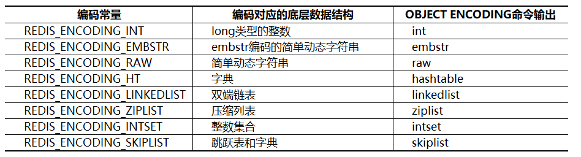
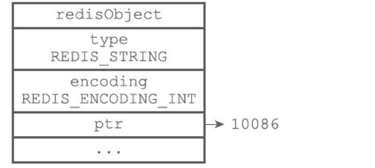
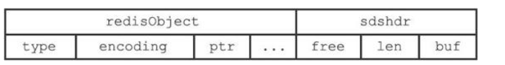
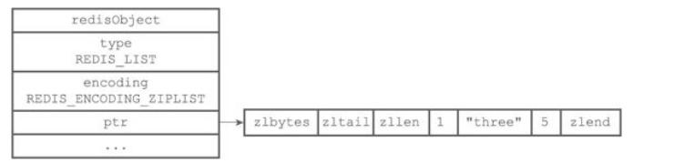
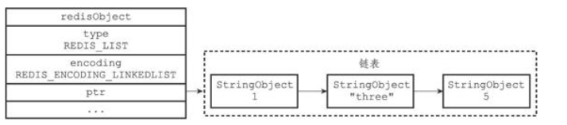
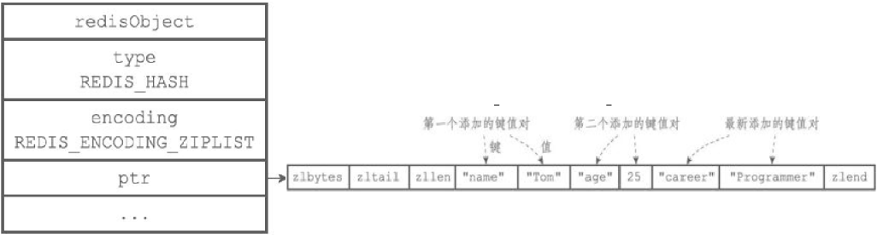
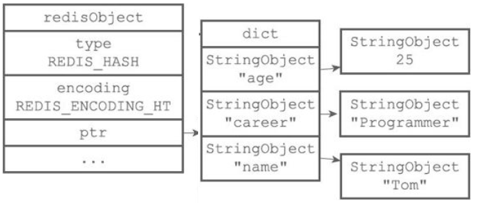
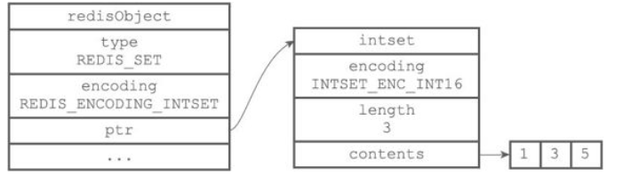
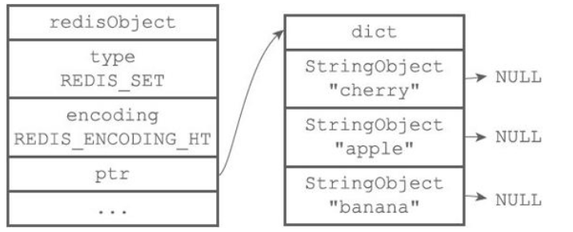

# redis五种数据结构

## 概述
- Redis的五大数据类型也称五大数据对象，包含了字符串对象（string）、列表对象（list）、哈希对象（hash）、集合（set）对象和有序集合对象（zset）
- redis是以键值对存储数据的，所以对象又分为键对象和值对象，即存储一个key-value键值对会创建两个对象，键对象和值对象。键对象总是一个字符串对象，而值对象可以是五大对象中的任意一种。

## 字符串对象string
- 字符串对象底层数据结构实现为简单动态字符串（SDS）和直接存储，但其编码方式可以是int、raw或者embstr，区别在于内存结构的不同。

- int编码：字符串保存的是整数值，并且这个正式可以用long类型来表示，那么其就会直接保存在redisObject的ptr属性里，并将编码设置为int，如图

- raw编码：字符串保存的大于32字节的字符串值，则使用简单动态字符串（SDS）结构，并将编码设置为raw，此时内存结构与SDS结构一致，内存分配次数为两次，创建redisObject对象和sdshdr结构，如图：

- embstr编码：字符串保存的小于等于32字节的字符串值，使用的也是简单的动态字符串（SDS结构），但是内存结构做了优化，用于保存顿消的字符串；内存分配也只需要一次就可完成，分配一块连续的空间即可，如图：

## 列表对象list
- 列表对象的编码可以是ziplist和linkedlist之一。

- ziplist编码的列表对象底层实现是压缩列表，每个压缩列表节点保存了一个列表元素。

- linkedlist编码底层采用双端链表实现，每个双端链表节点都保存了一个字符串对象，在每个字符串对象内保存了一个列表元素。

- 列表对象编码转换：
	- 列表对象使用ziplist编码需要满足两个条件：一是所有字符串长度都小于64字节，二是元素数量小于512，不满足任意一个都会使用linkedlist编码。
	- 两个条件的数字可以在Redis的配置文件中修改，list-max-ziplist-value选项和list-max-ziplist-entries选项。
	- 图中StringObject就是上一节讲到的字符串对象，字符串对象是唯一个在五大对象中作为嵌套对象使用的。

## 哈希对象hash
- 哈希对象的编码可以是ziplist和hashtable之一。

- ziplist编码的哈希对象底层实现是压缩列表，在ziplist编码的哈希对象中，key-value键值对是以紧密相连的方式放入压缩链表的，先把key放入表尾，再放入value；键值对总是向表尾添加。

- hashtable编码的哈希对象底层实现是字典，哈希对象中的每个key-value对都使用一个字典键值对来保存。

- 哈希对象编码转换：
	- 哈希对象使用ziplist编码需要满足两个条件：一是所有键值对的键和值的字符串长度都小于64字节；二是键值对数量小于512个；不满足任意一个都使用hashtable编码。
	- 以上两个条件可以在Reids配置文件中修改hash-max-ziplist-value选项和hash-max-ziplist-entries选项。

## 集合对象set
- 集合对象的编码可以是intset和hashtable之一。

- intset编码的集合对象底层实现是整数集合，所有元素都保存在整数集合中。

- hashtable编码的集合对象底层实现是字典，字典的每个键都是一个字符串对象，保存一个集合元素，不同的是字典的值都是NULL；可以参考java中的hashset结构。

- 集合对象编码转换:
	- 集合对象使用intset编码需要满足两个条件：一是所有元素都是整数值；二是元素个数小于等于512个；不满足任意一条都将使用hashtable编码。
	- 以上第二个条件可以在Redis配置文件中修改et-max-intset-entries选项。

## 有序集合对象zset
- 有序集合的编码可以是ziplist和skiplist之一。

- ziplist编码的有序集合对象底层实现是压缩列表，其结构与哈希对象类似，不同的是两个紧密相连的压缩列表节点，第一个保存元素的成员，第二个保存元素的分值，而且分值小的靠近表头，大的靠近表尾。

- skiplist编码的有序集合对象底层实现是跳跃表和字典两种；
	- 每个跳跃表节点都保存一个集合元素，并按分值从小到大排列；节点的object属性保存了元素的成员，score属性保存分值；
	- 字典的每个键值对保存一个集合元素，字典的键保存元素的成员，字典的值保存分值。

- 为何skiplist编码要同时使用跳跃表和字典实现？
	- 跳跃表优点是有序，但是查询分值复杂度为O(logn)；字典查询分值复杂度为O(1) ，但是无序，所以结合连个结构的有点进行实现。
	- 虽然采用两个结构但是集合的元素成员和分值是共享的，两种结构通过指针指向同一地址，不会浪费内存。

- 有序集合编码转换：
	- 有序集合对象使用ziplist编码需要满足两个条件：一是所有元素长度小于64字节；二是元素个数小于128个；不满足任意一条件将使用skiplist编码。
	- 以上两个条件可以在Redis配置文件中修改zset-max-ziplist-entries选项和zset-max-ziplist-value选项。

## 总结
- 在Redis的五大数据对象中，string对象是唯一个可以被其他四种数据对象作为内嵌对象的；

- 列表（list）、哈希（hash）、集合（set）、有序集合（zset）底层实现都用到了压缩列表结构，并且使用压缩列表结构的条件都是在元素个数比较少、字节长度较短的情况下；

- 四种数据对象使用压缩列表的优点：

	- （1）节约内存，减少内存开销，Redis是内存型数据库，所以一定情况下减少内存开销是非常有必要的。
	- （2）减少内存碎片，压缩列表的内存块是连续的，并分配内存的次数一次即可。
	- （3）压缩列表的新增、删除、查找操作的平均时间复杂度是O(N)，在N再一定的范围内，这个时间几乎是可以忽略的，并且N的上限值是可以配置的。
	- （4）四种数据对象都有两种编码结构，灵活性增加。