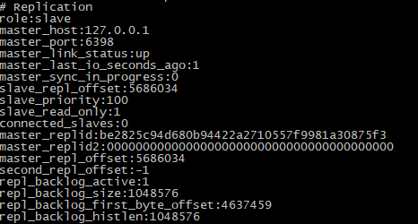
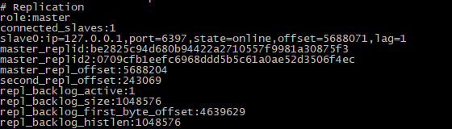
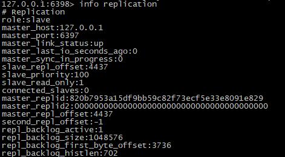
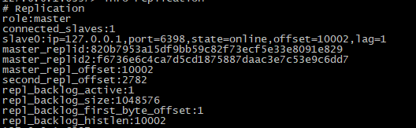

# redis集群之主从与哨兵

## 概述
- redis有三种集群模式，分别是主从模式、sentinel哨兵模式、cluster模式（集群分片模式暂不介绍）

## 主从模式
- 主从模式中，数据库分为两种，主数据库（master）和从数据库（slave），他们的特点是:
	- 主数据库可以进行读写功能，当写操作导致数据变化时会自动将数据同步给从数据库
	- 从数据库只读，并且接受主数据库同步过来的数据
	- 一个master可以对应多个slave，一个slave只能对应一个master
	- master挂了之后，不影响slave的读，但redis服务不再提供写服务

- 工作机制：当slave启动后，主动向master发送SYNC命令。master接收到SYNC命令后在后台保存快照（RDB持久化）和缓存保存快照这段时间的命令，然后将保存的快照文件和缓存的命令发送给slave。slave接收到快照文件和命令后加载快照文件和缓存的执行命令。复制初始化后，master每次接收到的写命令都会同步发送给slave，保证主从数据一致性。

- 安全设置：当master设置密码后，客户端访问master需要密码，启动slave需要密码，在slave配置文件中配置即可。
- 缺点：master挂了后无法对外提供写服务

- 主从搭建：部署两个redis服务，master服务与slave服务的redis.conf配置不同，部署在同一台机器上，两个redis的端口配置不同
	- master配置如下
	```yml
	bind 127.0.0.1              #绑定地址
	port 6398
	daemonize yes               #是否允许后台启动
	logfile "log/redis.log"     #日志路径
	dir ./                      #数据库备份文件目录
	masterauth 123456           #作为slave时，连接master的密码
	requirepass 123456          #作为master时的连接密码
	appendonly yes              #aof模式是否开启
	```
	- slave配置如下
	```yml
	bind 127.0.0.1              #绑定地址
	port 6397
	daemonize yes               #是否允许后台启动
	logfile "log/redis.log"     #日志路径
	dir ./                      #数据库备份文件目录
	replicaof 127.0.0.1 6398
	masterauth 123456           #作为slave时，连接master的密码
	requirepass 123456          #作为master时的连接密码
	appendonly yes              #aof模式是否开启
	```
	- 服务启动后，分别info replication查看redis集群状态，如下图

	

	


## sentinel哨兵模式
- 主从模式的弊端就是不具备高可用性，当master挂掉以后，Redis将不能再对外提供写入操作，因此sentinel应运而生。sentinel中文含义为哨兵，顾名思义，它的作用就是监控redis集群的运行状况，特点如下：
	- sentinel模式建立在主从模式的基础上
	- 当master挂了之后，sentinel会在slave中选择一个作为master，并修改他们的配置文件，其他slave的配置文件也会被修改（replicaof ~）
	- 当master重新启动后，它将不再是master，而是作为slave接受新master的同步数据
	- sentinel作为一个进程也有挂掉的可能，所以sentinel也会启动多个形成一个sentinel集群
	- 多sentinel配置时，sentinel之间也会互相自动监控
	- 一个sentinel或sentinel集群可以管理多个主从redis，多个sentinel也可监控同一个redis

- 工作机制：
	- 每个sentinel每秒向它已知的master，slave以及其他sentinel实例发送一个ping
	- 如果一个实例距离最后一次有效回复ping命令的时间超过配置中down-after-milliseconds所指定的值，则这个实例会被标记为主观下线
	- 如果一个master被标记为主观下线，则正在监视这个master的所有sentinel都要每秒一次确认master的确进入了主观下线状态
	- 当足够数量的sentinel（大于配置值）在指定时间内确认master主观下线，则master会被标记为客观下线
	- 在一般情况下，每个sentinel会10秒一次向已知master、slave发送info命令
	- 当master被标记为客观下线时，sentinel下发info命令的频率从10s一次变成1s一次
	- 若没有足够数量的sentinel标记master主观下线，则master的客观下线状态就会被移除，但原master此时会变成新master的slave

- sentinel搭建
	- 使用刚才搭建的主从作为redis集群
	- 修改sentinel.conf文件，配置内容如下
	- 注意一点和redis服务启动不同的是，sentinel启动是调用方法./src/redis-server sentinel.conf
	```yml
	bind 127.0.0.1              				#绑定地址
	port 26379
	daemonize yes               				#是否允许后台启动
	logfile "log/sentinel.log"     				#日志路径
	dir ./                      				#sentinel工作目录
	sentinel monitor mymaster 127.0.0.1 6398 1 	#判断master失效需要sentinel确认的个数，一般建议设置为sentinel个数/2+1,这里就配一台简单测试~
	sentinel auth-pass mymaster 123456 			#连接master使用的密码
	sentinel down-after-milliseconds mymaster 30000 #一般默认为30s
	```
	- 启动sentinel后，主动kill掉master（6398），然后再启动6398端口的redis，会发现原从服务6397已变成master，而6398变成了slave，如下图。
	
	

- 当使用sentinel模式的时候，客户端就不要直接连接Redis，而是连接sentinel的ip和port，由sentinel来提供具体的可提供服务的Redis实现，这样当master节点挂掉以后，sentinel就会感知并将新的master节点提供给使用者。