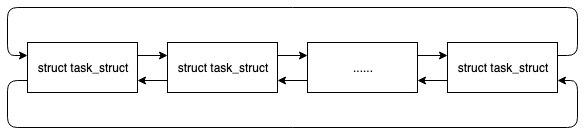
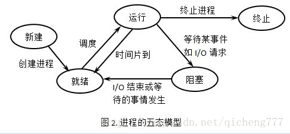
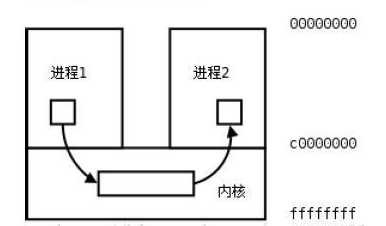
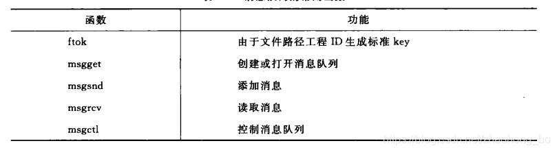
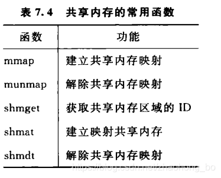

## 操作系统

#### 进程/线程

##### 创建与执行

进程是资源**分配**基本单位

线程是资源**调度**基本单位

在linux中，进程是特殊的线程，所有线程都是通过`fork,exec`创建的，`fork` 从当前进程创建一个子进程，此函数返回两次，对于父进程而言，返回的是子进程的进程号，对于子进程而言返回 0。

子进程是父进程的副本，拥有与父进程一样的数据空间、堆和栈的副本，并且共享代码段。`fork` 之后子进程会继承父进程的很多东西，如：

-   打开的文件

-   实际用户 ID、组用户 ID 等

-   进程组

-   当前工作目录

-   信号屏蔽和安排

父子进程的区别在于：

-   进程 ID 不同
-   子进程不继承父进程的文件锁
-   子进程的未处理信号集为空

Linux 采用了**写时拷贝**技术，即数据段、堆和栈的副本并不会在 `fork` 之后就真的拷贝，只是将这些内存区域的访问权限变为只读，如果父子进程中有任一个要修改这些区域，才会修改对应的内存页生成新的副本，这样子是为了提高性能。

##### 进程描述符

进程在运行的时候，除了加载程序，还会打开文件、占用一些资源，并且会进入睡眠等其它状态。操作系统为了支持进程的运行，必然有一个数据结构保存着这些东西。在 Linux 中，一个名为 `task_struct` 的结构保存了进程运行时的所有信息，称为进程描述符：

```c++
struct task_struct {
    unsigned long state;
    int prio;
    pid_t pid;
    ...
}
```

系统将所有的进程描述符放在一个双端循环列表中：



##### 进程状态

进程描述符中的 `state` 描述了进程当前的状态，有如下 5 种：

1.  TASK_RUNNING：进程是可执行的，此时进程要么是正在执行，要么是在运行队列中等待被调度（包括**runnging**和**ready**）
2.  TASK_INTERRUPTIBLE：进程正在睡眠（阻塞），等待条件达成。如果条件达成或者收到信号，进程会被唤醒并且进入可运行状态
3.  TASK_UNINTERRUPTIBLE：进程处于不可中断状态，就算信号也无法唤醒，这种状态用的比较少
4.  _TASK_TRACED：进程正在被其它进程追踪，通常是为了调试
5.  _TASK_STOPPED：进程停止运行，通常是接收到 SIGINT、SIGTSTP 信号的时候。



##### 进程通信

###### 常见的通信方式

1.   管道pipe：管道是一种半双工的通信方式，数据只能单向流动，而且只能在具有亲缘关系的进程间使用。进程的亲缘关系通常是指父子进程关系。
2.   命名管道FIFO：有名管道也是半双工的通信方式，但是它允许无亲缘关系进程间的通信。
3.   消息队列MessageQueue：消息队列是由消息的链表，存放在内核中并由消息队列标识符标识。消息队列克服了信号传递信息少、管道只能承载无格式字节流以及缓冲区大小受限等缺点。
4.   共享存储SharedMemory：共享内存就是映射一段能被其他进程所访问的内存，这段共享内存由一个进程创建，但多个进程都可以访问。共享内存是最快的 IPC 方式，它是针对其他进程间通信方式运行效率低而专门设计的。它往往与其他通信机制，如信号量，配合使用，来实现进程间的同步和通信。
5.   信号量Semaphore：信号量是一个计数器，可以用来控制多个进程对共享资源的访问。它常作为一种锁机制，防止某进程正在访问共享资源时，其他进程也访问该资源。因此，主要作为进程间以及同一进程内不同线程之间的同步手段。
6.   套接字Socket：套解口也是一种进程间通信机制，与其他通信机制不同的是，它可用于不同机器间的进程通信。
7.   信号 ( sinal ) ： 信号是一种比较复杂的通信方式，用于通知接收进程某个事件已经发生。

###### 管道

管道是半双工。有固定读端，写端，用于父子，兄弟进程通信。可以看作特殊的文件，可以用read,write函数。

管道分为pipe（无名管道）和fifo（命名管道）两种除了建立、打开、删除的方式不同外，这两种管道几乎是一样的。他们都是通过内核缓冲区实现数据传输。

+   pipe用于相关进程之间的通信，例如父进程和子进程，它通过pipe()系统调用来创建并打开，当最后一个使用它的进程关闭对他的引用时，pipe将自动撤销。
+   FIFO即命名管道，在磁盘上有对应的节点，但没有数据块——换言之，只是拥有一个名字和相应的访问权限，通过mknode()系统调用或者mkfifo()函数来建立的。一旦建立，任何进程都可以通过文件名将其打开和进行读写，而不局限于父子进程，当然前提是进程对FIFO有适当的访问权。当不再被进程使用时，FIFO在内存中释放，但磁盘节点仍然存在。

管道的实质是一个内核缓冲区，进程以先进先出的方式从缓冲区存取数据：管道一端的进程顺序地将进程数据写入缓冲区，另一端的进程则顺序地读取数据，该缓冲区可以看做一个循环队列，读和写的位置都是自动增加的，一个数据只能被读一次，读出以后再缓冲区都不复存在了。当缓冲区读空或者写满时，有一定的规则控制相应的读进程或写进程是否进入等待队列，当空的缓冲区有新数据写入或慢的缓冲区有数据读出时，就唤醒等待队列中的进程继续读写。



无名管道的主要区别在于，命名管道有一个名字，命名管道的名字对应于一个磁盘索引节点，有了这个文件名，任何进程有相应的权限都可以对它进行访问。

Linux中通过系统调用mknod()或makefifo()来创建一个命名管道。最简单的方式是通过直接使用shell

```shell
mkfifo myfifo
1
```

等价于

```c++
mknod myfifo p
```

以上命令在当前目录下创建了一个名为myfifo的命名管道。用ls -p命令查看文件的类型时，可以看到命名管道对应的文件名后有一条竖线"|"，表示该文件不是普通文件而是命名管道。

使用open()函数通过文件名可以打开已经创建的命名管道，而无名管道不能由open来打开。当一个命名管道不再被任何进程打开时，它没有消失，还可以再次被打开，就像打开一个磁盘文件一样。

可以用删除普通文件的方法将其删除，实际删除的事磁盘上对应的节点信息。

###### 消息队列

消息队列，就是一个消息的链表，是一系列保存在**内核**中消息的列表。用户进程可以向消息队列添加消息，也可以向消息队列读取消息。

消息队列与管道通信相比，其优势是对每个消息指定特定的消息类型，接收的时候**不需要按照队列次序**，而是可以根据自定义条件接收特定类型的消息。

常用方法：



###### 共享内存

共享内存允许两个或多个进程共享一个给定的存储区，这一段存储区可以被两个或两个以上的进程映射至自身的地址空间中，一个进程写入共享内存的信息，可以被其他使用这个共享内存的进程，通过一个简单的内存读取错做读出，从而实现了进程间的通信。

采用共享内存进行通信的一个主要好处是效率高，因为进程可以直接读写内存，而不需要任何数据的拷贝，对于像管道和消息队里等通信方式，则需要再内核和用户空间进行四次的数据拷贝，而共享内存则只拷贝两次：一次从输入文件到共享内存区，另一次从共享内存到输出文件。

进程之间在共享内存时，保持共享区域，直到通信完毕为止，数据内容一直保存在共享内存中，并没有写回文件。共享内存中的内容在解除映射时才写回文件，因此，采用共享内存的通信方式效率非常高。

共享内存有两种实现方式：1、内存映射 2、共享内存机制



###### 信号量

信号量（semaphore）与已经介绍过的 IPC 结构不同，它是一个计数器。信号量用于实现进程间的互斥与同步，而不是用于存储进程间通信数据。

需要结合共享内存使用，基于操作系统PV操作。

