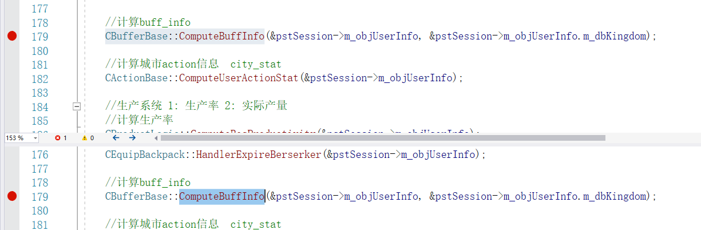

阅读代码重点：

1. 业务逻辑理顺
2. 梳理主要数据结构，数据源。
3. 数据如何流动：包括从哪拉取，怎么拉取，如何存储，怎么处理

狂化

+   装备狂化

+   牛仔狂化

    流程：校验->强化->消费，弹窗->计算有关奖励

    校验条件：cowboy已解锁，item数量正确且足够

    用到的数据：

    +   CGameInfo::GetInstance()->m_oJsonRoot["game_cowboy_berserker"]

    +   CGameInfo::GetInstance()->m_oJsonRoot["game_cowboy"]
    +   CGameInfo::GetInstance()->m_oJsonRoot["game_item"]
    +   CGameInfo::GetInstance()->m_oJsonRoot["game_temporary_reward"]

    +   pstSession->m_objUserInfo->m_dbUser.m_ctpCowboy->m_jsnCowboy_list//用户狂化牛仔列表
    +   pstSession->m_objUserInfo->m_dbUser.m_ctpBackpack_item//用户所含有的资源
    +   pstSession->m_objUserInfo->m_objComInfo.m_stUserDataChange

    

11.16

1. 任务：整理牛仔buff计算相关，写一个指定cowboy，消除其狂化buff

2. 位置：D:\westgame\common\logic\buff_base.cpp  ::26 

    TINT32 CBufferBase::ComputeBuffInfo(CUserInfo *poUser, CDbKingdom* pdbKingdom){}
    	
    D:\westgame\common\logic\buff_base.cpp  ::1028 
    	
    TINT32 CBufferBase::ComputeCowboyBuff(CUserInfo *poUser){}
    	

3.   计算流程：
     
4. 用到的数据：
   

+   game.json: ["game_cowboy"],["game_cowboy_lv"],["game_cowboy_star"],["game_cowboy_skill"]
	
	+   poUser->m_dbUser:     m_ctpCowboy,
5. 流程：
	1.   从配置和session中取出数据，
	
	2.   判断当前是否狂化，狂化且未满星则星级+1,stage变成0
	
	3.   判断牛仔数据是否正确，用户是否有这个牛仔，等级是否正确
	
	4.   计算牛仔战力force=（cowboy_star[牛仔当前星级  ]\[牛仔当前阶级\][2]+该英雄已解锁的所有技能的cowboy_skill[技能星级\][牛仔当前技能等级\][1]）*cowboy_lv[牛仔当前等级\][3\]/10000
	    5.    设置牛仔force到session的UserInfo->m_dbUser.m_ctpCowboy->m_jsnCowboy_list[CowboyId]中，并设置更新数据标记位。
	    
	    5.   设置poUser->m_objComInfo.m_stPlayerBuffList，bufferid为84.
	    
	    5.   计算牛仔技能buff，如果满足技能解锁，且属于英雄技能属于激活生效进行计算
	    
	    5.   buffer=效果基础数值\*（10000+cowboy_star[牛仔当前星级\][牛仔当前阶级\][0]+cowboy_skill[技能星级\][技能当前等级\][0]）/10000\*（10000+cowboy_lv[牛仔当前等级\][4\]）/10000	
	    
	    5.   设置poUser->m_objComInfo.m_stPlayerBuffList，bufferid为配置中对应参数
	    

11.17

1. 任务：阅读hu命令字：城市守卫“set_city_defender”，攻击“march_attack”

   set_city_defender：

   1. 流程：解析参数，校验，设置新的牛仔队列数据

   2. 用到的数据

      1. url数据：守卫的牛仔的idpstSession->m_stReqParam.m_jParam["key0"]

      2. session数据：pstSession->m_objUserInfo.m_objComInfo.m_stPlayerBuffList,

         ​						pstSession->m_objUserInfo->m_dbUser.m_ctpCowboy

   3. 检验：url中cowboyid不能重复、非0、且都需要已解锁，合法的（非0）cowboy的数量不能超限。

   4. 判断是否需要反包：旧的没有牛仔数量为0和新旧两个的牛仔队列相同则不需反包。

   5. 如果需要反包，设置到session。将pstCowboy->m_jsnCity_defender清空，如果新的的cowboy队列中有旧的队列中没有的牛仔，如果牛仔状态不在行军，状态置为防御，在 pstCowboy->m_jsnCowboy_list中设置。将旧有队列中有的，但新队列中没有的cowboy，状态置为normal。设置状态改变标志位CTpCowboy.m_szFieldState[TbCOWBOY_FIELD_COWBOY_LIST],CTpCowboy.m_szFieldState[TbCOWBOY_FIELD_CITY_DEFENDER]

   march_attack与cowboy有关:

   1. 流程：

      ​	压栈：

      ​		CProcessMarchAttack.ProcessParam

      ​		CProcessMarch.GetMapBlockInfo

      ​		CProcessMarchAttack.CheckNeedExtraInfo

      ​				CProcessMarchAttack.CheckTerritoryPeace

      ​							CProcessMarchAttack.CheckTerritoryPeace_OnPsp

      ​		CProcessMarch.CheckMarchTime

      ​		CProcessMarchAttack.ComputeMarchAction

      ​		CProcessMarch.GenMarchAfter

      2.用到的数据：
   
      1. session数据：
      
         pstSession->m_objUserInfo->m_udwBSeqNo
      
         pstSession->m_stReqParam["key5"]（出征牛仔队列）
      
         pstSession->m_objUserInfo->m_dbUser.m_ctpCowboy->m_jsnCowboy_list
         
      2. game.json：
      
         GameJson["game_kingdom_building"]
      
         GameJson["game_ava_battle_building"]……
      
      3.流程：
      
      1. 解析url中string参数为vector
      
      2. 校验是否有相同cowboy参数，是否有相同cowboy、状态是否是守卫/normal
      
      3. data层拉数据，cmd=march11_marchcardlist
      
      4. 设置ptbMarchAction->m_jsnMarch_card_info包括type\lv\star\name\status\stage_lv\skill_lv\berserker_end_time//
      
      5. 设置pstUser->m_dbUser.m_ctpCowboy->m_jsnCowboy_list[szCowboyId]，包括status，action_id,并设置更新标志位
      
          pstCowboy->Update_Cowboy_list();和ptbMarchAction->Update_March_card_info();
      
      
   

11.18

1. 阅读hu命令字“set_cowboy_slot”

   “set_cowboy_slot”：

   1. 数据：url:pstSession->m_stReqParam.m_jParam（input）

      ​			game.json：["game_cowboy"]（input）

      ​			session数据：pstUser->m_dbUser.m_ctpCowboy->m_jsnCowboy_list（input）

      ​									 pstUser->m_dbUser.m_ctpCowboy->m_jsnCowboy_slot（output）

   2. 校验：cowboy的id非零，不重复且已被解锁

   3. 流程：url参数[key0]转vector，校验，填数据，设置更新位

   

2. 写命令字“op_set_city_defender”,"op_set_cowboy_slot"：输入id，随机数量n，在已有牛仔（未行军）状态中随机n个牛仔设为守卫

   “op_set_city_defender”

   1. 流程：解析参数，读出已有牛仔，过滤状态为marching的，生成随机牛仔队列，调用接口更新

   2. 数据：url：随机数量n，

      ​			session数据：	pstUser->m_dbUser.m_ctpCowboy->m_jsnCowboy_list

   ​										pstUser->m_dbUser.m_ctpCowboy

   ​																m_objUserInfo.m_objComInfo.m_stPlayerBuffList[EN_BUFFER_INFO_CITY_DEFENDER_LIMIT]……

   "op_set_cowboy_slot"

   1. 流程：解析参数，读出已有牛仔，过滤状态为marching的，生成随机牛仔队列，调用接口更新

11.19

1.完成命令字“op_set_city_defender”,"op_set_cowboy_slot"

12-13

牛仔的展示

1. 在展示界面 城防界面 牛仔界面三个地方使用到的表： svr_city_defender svr_cowboy_info

svr_cowboy_info用到的数据：

​	tuple：CTpCowboy->m_jsnCowboy_list遍历填充"cowboys"字段

​				CTpCowboy->m_jsnChest_next_free_time填充"chestNextFreeTime"字段

​				CTpCowboy->m_jsnCowboy_slot遍历填充"cowboySlot"字段

svr_city_defender 用到的数据：

​		tuple：m_dbUser.m_ctpCowboy.m_jsnCity_defender遍历填充"cardList"字段

​					pstSession->m_objUserInfo.m_dbUser.m_ctpCowboy.m_ddwPlan_id填充"guardPlanId"字段

2. CProcessPlayer::GenProcedure中CCommonHandle::HandleAfter的CBufferBase::ComputeBuffInfo

   在handlebefore和handle都有进行了`CBufferBase::ComputeBuffInfo`计算。

   

   是因为在CProcessPlayer::ProcessCmd中可能是执行狂化等影响技能等级，最后影响buff计算的操作。

3. m_stPlayerBuffList是存放buff的地方。

   在通用流程的最后一个`pstSession->m_Procedure.push(new DelegateHandler<void>(&CRspProcedure::SendbackRsp)); //send back result`中打包到svr_buff_info。

   CRspProcedure::SendbackRsp

   ->StoreJson(pstSession)
   
   ->StoreJson_String(pstSession)/StoreJson_Binary(pstSession)
   
   ->pstSession->m_pJsonGen->GenResult(pstSession)/pstSession->m_pJsonGen->GenResult_Pb(pstSession)**PB**
   
   ->GenDataJson(pstSession, &m_mapPbResult)
   
   class CBufferInfoJson继承了抽象类CBaseOutput，重载纯虚函数GenDataJson。在通用流程中根据命令字设置的反包类型`pstSession->m_stRspParam.m_ucJsonType`字段`enum EJsonType`来决定动态选择具体实现的方法。
   
   在最后output的时候从`pstUser->m_objComInfo.m_stPlayerBuffList.m_astPlayerBuffInfo[dwBuffId]`，
   
   存储到svr_buff_info中，

目标:

12-17：阅读服务op-svr

服务功能：拉取当前的活动。

线程模型：网络CSearchNetIO，CQueryNetIO，工作线程：CTaskProcess

ProcessCommand：存放所有请求

`CProcessEventNew::ProcessCmd_AllEventGetNew`:

在通用流程的最后一个`pstSession->m_Procedure.push(new DelegateHandler<void>(&CRspProcedure::SendbackRsp)); //send back result`中打包到svr_buff_info。

CRspProcedure::SendbackRsp

->StoreJson(pstSession)

->StoreJson_String(pstSession)/StoreJson_Binary(pstSession)

->pstSession->m_pJsonGen->GenResult(pstSession)/pstSession->m_pJsonGen->GenResult_Pb(pstSession)**PB**

->GenDataJson(pstSession, &m_mapPbResult)

class CBufferInfoJson继承了抽象类CBaseOutput，重载纯虚函数GenDataJson。在通用流程中根据命令字设置的反包类型`pstSession->m_stRspParam.m_ucJsonType`字段`enum EJsonType`来决定动态选择具体实现的方法。

在最后output的时候从`pstUser->m_objComInfo.m_stPlayerBuffList.m_astPlayerBuffInfo[dwBuffId]`，

存储到svr_buff_info中，
