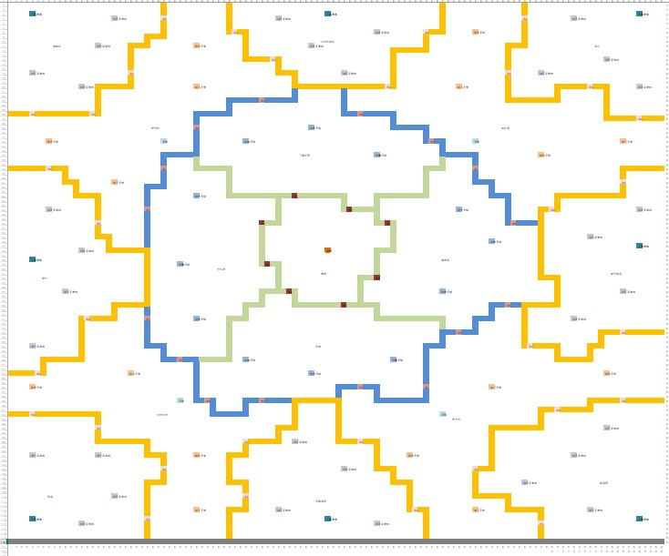
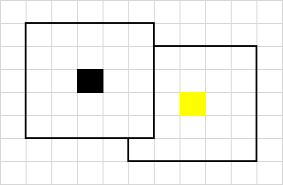
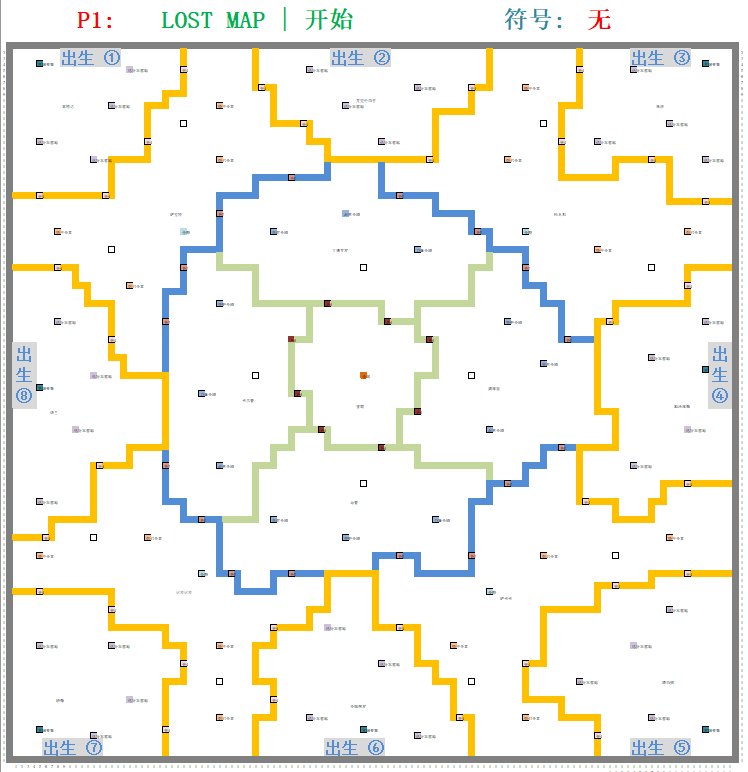
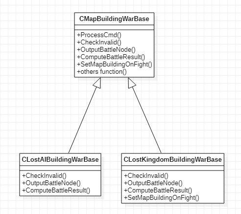
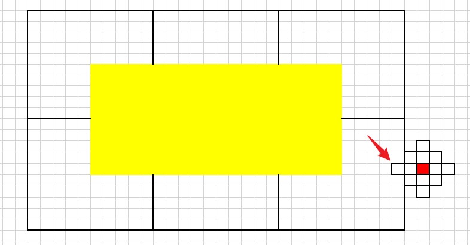
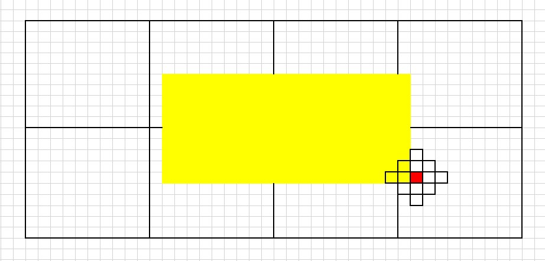
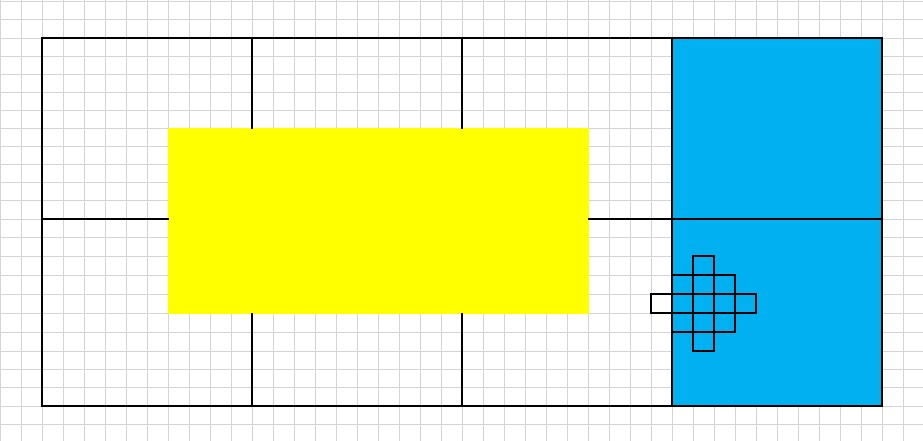
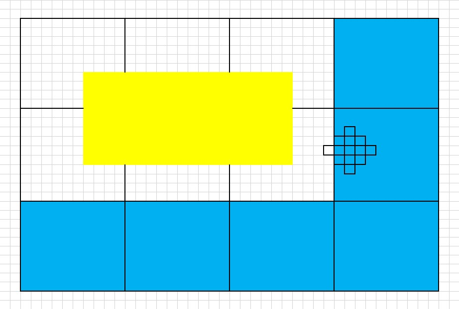
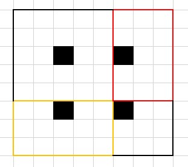

#失落之地整体实现
##一、需求概要
###1.新增战场
与原有世界地图的 500 * 1200不同，新增的失落之地战场是一个 850 * 850 的独立战场，如下图所示

a.地图被山脉（带颜色的线条表示）分割成多个区域，每个区域之间有**关卡**建筑，成功占领关卡可以通往另一个区域
b.初始时，所有关卡都处于**未开放**的状态，随着活动的进行，会逐步放开关卡，玩家可通行的区域也会越来越多。

###2.建筑

a.每个区域中有**固定的建筑**，可供玩家占领，获得buff。
b.每个区域之间通过**关卡**进行连接。
c.玩家可以在**可达**区域建**联盟建筑**。
d.每个建筑都可以有**战争行为**，不同建筑的战争结果不同。

###3.领地
a.每个**建筑**都提供一定范围大小的领地。


b.领地可以重合，归属优先级：固有建筑 > 先完成建筑的联盟建筑 > 后完成建造的联盟建筑。



c.正在建造的联盟建筑的领地只展示，不实际生效。
d.领地可以相连，只有直接/间接与联盟分要塞。


###4.rank榜
与普通服务器相同，失落之地服务器有单独的rank排行，在参与活动的8个服务中，所有进入过失落之地的玩家，均会参与失落之地rank榜，直到活动结束。

###5.编年史活动
类似于普通服的博物馆活动，所有参与失落之地的服务器一起做的任务，达成特定任务能触发解锁指定建筑/关卡，或者地形。用于控制活动的进展。

###6.活动流程
```sequence
Note left of 运营: 开活动
Note left of 编年史: 加载活动
编年史->战场: 初始化
Note left of 编年史: 预告期
玩家->战场: 查看
Note left of 编年史: 进行期
玩家->战场: 进入出生点
Note right of 玩家: 在出生点扩张地盘
编年史->战场: 半开放关卡1
Note right of 玩家: 可以抢占关卡1，并往外拓张地盘
编年史->战场: 开放关卡2
Note right of 玩家: 可以进出关卡2，并继续拓张地盘
编年史->战场: 开放关卡3
Note right of 玩家: 可以进出关卡3，并抢占中心建筑
编年史->战场: 开放关卡1
Note right of 玩家: 可以进入其它出生点
Note left of 编年史: 结束期
战场->玩家: 踢出

```
###7.参战流程



##二、功能拆分
1. 战场初始化/清理
2. 建筑
3. 领地&区域连通
4. 联盟其它
5. 缩略图
6. 排行榜
7. 刷地
8. 聊天
9. 编年史活动
10. 玩家行为


##三、战场初始化/清理
###1.配置发布
```sequence
op->s3: 同步同步排期配置
s3->svr: 发布文件
```

###2.战场初始化流程
```sequence
Note right of 编年史: crontab
编年史->hu_op: init req
hu_op->action_svr_uid: 生成活动流程action
au->action_svr_uid: 拿到init action
au->map: clear战场
au->kingdom_svr: 清理编年史相关信息
au->rank: clear rank
au->map: init战场
map->map: init
Note left of map: 不写表
au->chat: clear chat
au->delay_msg_svr: 战场开启广播action op cmd
au->delay_msg_svr: 战场结束广播action op cmd
au->action_svr_uid: 修改自身状态为clear
``` 

###3.战场清理流程
```sequence
Note right of action_svr_uid: 到达清理时间
au->action_svr_uid: 拿到clear action
au->map: clear战场
map->map: clear
Note left of map: 不写表
au->kingdom_svr: 清理编年史相关信息
au->rank: clear rank
au->chat: clear chat
au->action_svr_uid: 删自己
```

##四、建筑

###1.固有建筑
失落之地中每个区域都有少量固定无主的建筑，可供玩家占领。成功占领下之后，可以获得该建筑的buff。持续占领一定时长，建筑会进入一定时间的和平期。和平期结束之后，建筑会重新进入争夺期，周而复始。

####a.状态
所有的固有建筑在活动初期都处于未开放（永久和平期）的状态。随着编年史任务的达成，会逐步放开建筑。因同名建筑是同一批次放开，存在集中结算，又因存在时期转换，故使用status&end_time，结合action处理。

状态|status|end_time|说明
--|:--:|--|--
永久和平期（无倒计时）|0|0|未开放
和平期|0|任意|开放后，时期转换使用，end time是action结算时间
争夺期|1|任意|开放后，时期转换使用，end time是action结算时间
未开放(有倒计时)|2|end_time > cur_time|未开放时，统一放开使用
争夺期(无倒计时)|2|end_time < cur_time|未开放时，统一放开使用

####b.占领机制
**需求**
1. 战争胜利，则进攻方占领建筑，进攻队列入驻
2. 持续占领一定时长，则进入和平期
3. 进入争夺期的时间越长，则进入和平期所需要的持续占领时长越短

**实现**
数值按阶段配置建筑进入争夺期时长，对应到需要持续占领时长，如下（举例）：
进入争夺期时长（分钟）|需要持续占领时长（分钟）
:--:|:--:
0|90
30|60
60|40
90|20
在每次易主时，更新时期转换action，并根据当前已进入争夺期的时长，重新从数值中取出需要持续占领的时长，设置为action与map的end time


####c.占领效果
**需求**
1. 首战奖励：放开建筑之后，首次持续占领使其进入和平期的联盟，能得到额外联盟礼物奖励
2. 占领buff：联盟占领地形且保持有效领地连接即可生效

**实现**
1. 在map数据中，记录has_reward字段，进入和平期action结算时，判断若为1，则发奖，并将期设置为0
2. 在hu/au主流程中，会根据aid把所占领的固有建筑拉回来，在compute buff流程中遍历地块进行计算

####d.附属地形
**需求**
固有建筑周围有一定范围大小的附属地形（密林），与普通服的密林效果相同，具有以下几个功能：
1. 位于密林上的玩家主城被攻击，防守失败时，会立即触发被动随机移城
2. 位于密林上的玩家，不可以开保护罩
3. 玩家从其它位置移至密林时，会触发打破保护罩
4. march经过密林时，会有减速效果（增加行军时间）
   
**实现**
1. 判断是否为密林
对于普通服，hu/au加载了地形文件（类CSpecailMap），记录了每个坐标是不是密林。而失落之地的地图大小与普通服不同，密林的位置也有所不同，故不能使用原有的CSpecailMap。
从需求角度来看，密林的位置一定是在固有建筑/关卡周围，且大小与领地大小一致，故从数值表中进行预加载：遍历固有建筑/关卡的表，然后根据领地大小计算出所有相关坐标，并存储下来。
之后，在CSpecailMap::bIsSpecialMap中增加if分支，如果是失落之地，则从数值预加载的数据进行判断是不是密林。
2. 行军路径计算
使用原有通用的计算，只是修改适配地图大小 850 * 850 即可

####e.其它
战争
领地
区域

###2.关卡
####a.状态
失落之地中的关卡将会分四批逐步放开。首先是以半开放状态放开关卡1，在分别全开放关卡2与关卡3之后，才会全开放关卡1。从状态转换上分析，存在以下情况：

>未开放->半开放
>未开放->全开放
>半开放->全开放

而关卡只有在编年史的指定任务达成之后，才会统一修改状态，在达成任务之后x时间放开。若使用action实现，则有以下两种情况：
1. 每个建筑一条action，则会导致瞬时结算action数量增加
2. 一个战场使用一条action，则会导致单条请求更新的地块数量太大
考虑到除此之外没有状态切换的场景，使用status&end_time，配合逻辑做处理，故状态有：


状态|status|end_time
--|:--:|--
永久和平期（无倒计时）|0|0
未开放(有倒计时)|1|end_time > cur_time
半开放(无倒计时)|1|end_time < cur_time 
半开放(有倒计时)|2|end_time > cur_time 
全开放(无倒计时)|2|end_time < cur_time 
未开放(有倒计时)|3|end_time > cur_time 
全开放(无倒计时)|3|end_time < cur_time 

####b.附属地形
同固有建筑

####c.其它
战争
领地
区域

###3.联盟建筑
####a.建造
**需求**

```flow
st=>start: 发起建造
cond_rss=>condition: 联盟资源是否足够
hu_march=>operation: 消耗资源，记录资源消耗，发起march
hu_error=>operation: 报错退出
au_march=>operation: march到达
cond_map=>condition: 是否可建
au_succ=>operation: 生成建筑，march入驻成指挥官队列
au_error=>operation: 返还资源，记录资源返还，遣返march

e=>end
st->cond_rss
cond_rss(yes)->hu_march->au_march->cond_map
cond_rss(no)->hu_error->e
cond_map(yes)->au_succ->e
cond_map(no)->au_error->e
```

1. 发起时，与march到达时，都需要检测，新建的联盟建筑将会拥有的领地，是否与当前拥有的，有效领地相连
2. 发起时，与march到达时，都需要检测，发起点与目标点，是否区域连通


**实现**
1. 主要流程
```sequence
client->hu: 发起建造
hu->map: check cond
hu->action_svr_uid: 生成建造队列
hu->alliance: 消耗资源，生成使用记录
Note right of action_svr_uid: 队列到达
au->action_svr_uid: 拿到建行队列
au->map: check cond
au->map: 发起建造
map->map: 生成地块
au->action_svr_uid: 生成实际的建造action
au->action_svr_uid: 指挥官入驻
```
2. au给map发起建造的请求
只发送中心坐标，与建筑占地大小，不实际计算出所有涉及坐标，由map自行计算
map中计算出所有坐标之后，对涉及的所有地块全部回锁成功，才实际进行数据修改操作。如果其中有一块地加锁失败，则需要把之前已加好的锁全部释放，再把session丢加session队列中
3. hu au 向map check cond，check的是领地与区域相关，对应check逻辑实现在map中
4. 指挥官入驻之后，会根据当前自己是几个建筑的指挥官（有数量上限），选择性放弃一个建筑的指挥官权限

####b.拆除
####c.燃烧
####d.修复

####e.其它
战争
领地
区域

###4.建筑通用战争流程
####a.概要
1. 对于在建筑的攻防，绝大多数逻辑都是一致的，只有少数不同，如攻打成功的结果，发起条件等。故可以统一流程，之后新增加一类建筑，只处理特异化的部分即可。实现上利用了c++的多态机制，如下示意：

2. 相同行为对客户端提供的接口只有一个，根据map的类型取出对应的接口实例。此处使用了工厂模式。
3. action类型也只新增一套，根据action中记录的 target wild type做区分。report同。

####b.详细
见其它文档

####c. 实时推送
通过al p cache


###5. 建筑指挥官
**需求**
1. 成为建筑的指挥官，必须要官员以上身份
2. 失去官员身份时，自动放弃所有指挥官身份
3. 玩家最多可以成为N个建筑的指挥官，超过时自动放弃最早占领的，没有指挥官队列的那个建筑的指挥官身份
   
**实现**
1. 在失去身份时，通过delay msg svr，调用hu的op cmd，op_unassign_all_lost_building
2. 每次成为指挥官时，遍历自己当前的建筑情况，放弃最早的建筑


##五、领地&区域连通
###1.领地维护
见 svn://10.10.0.188/server_team/project/westgame/doc/失落之地/失落之地领地文档/失落之地领地文档.markdown
###2.地图展示
**需求**
1. 地图中需要展示出领地示意线，及是否有效、归属等
2. 领地变化时需要实时更新

**问题**
1. 领地与对应建筑需要同步展示 
2. 建筑数量太多，如果返回全量领地给客户端，数量量可能会很大
3. 进入失落之地的玩家数量较多，若领地按sid推送，则会导致推送量太大
4. 因为2、3，领地需要做成与地块一样的增量反回/推送，即视野滑动到哪里，则来拉哪里的领地数据
5. 由于领地大小比建筑大，在滑动地图时，会先滑到领地范围，才滑到建筑范围，而领地数据是与领地中心位置，即建筑位置有关。将会导致滑到领地范围时，看不到对应领地。
  地图视野如图所示
   
    黄色区域为玩家当前视野，每个黑色线框为一个block，当前视野正处于6个block的中心位置
    
    当视野外有一个建筑时
    
    会有部分领地无法提前看到，直到视野如下
    
    才会去拉右边两个block，才能突然看到有领地。若此时此建筑的领地与其它建筑的领地有归属/有效性性问题时，则会导致玩家看到错误的信息。

**解决**
1. 在无法返回全服领地详情下的，领地与建筑同步的问题
   在按bid拉地图（map get）时，顺便把bid相关的领地数据返回给客户端
   客户端原本在本地cache 20个bid的数据，领地保持一致
   给这20个bid推送领地
2. 滑动地图无法提前看到领地问题
   当视野超过一半的block时，就开始拉对应方向拓展的几个block的数据。如下图

   

   

##六、联盟其它
###1. 联盟资源 & 联盟资源仓库
**需求**
1. 在失落之地中，会使用一种属于联盟的资源，与属于用户的资源完全不同
2. 玩家可以使用联盟资源，去建造联盟建筑
3. 玩家在有效领地上采集用户资源，会给联盟增加一定的联盟资源
4. 一个联盟拥有的联盟资源有上限

**实现**
1. 新增一张属于联盟的表，用于记录联盟资源剩余量，如alliance_rss，即可
2. 对后台而言，联盟资源仓库并不用单独做处理，只是在获得联盟资源时做一下上限判断即可


###2. 联盟资源矿
**需求**
1. 战场初始化时，会按配置刷新出一定数量的，无主的联盟资源矿，不可占领，不可攻打。
2. 当联盟资源矿被a联盟的有效领地覆盖到时，将会自动为a联盟生产联盟资源

**实现**
在alliance_rss中，额外记录以下信息：
>当前剩余资源量：rss
>资源生产速度：speedup
>上一次更新时间：last_updt_time

于是当前实际的资源量为 
>rss + (cur_time + last_updt_time) * speedup

并不做实时数据更新的操作，只在以下场景进行更新：
>使用资源时（建造联盟建筑、修复联盟建筑）
>资源返还时（建造march到达目的地之后发现不满足条件，不可建造）
>生产速度发生变化时
>获得额外联盟资源时（联盟成员在有效领地上进行occupy行为）

客户端也根据此数据做假展示，让玩家认为资源是实时增加的。

关于联盟资源矿是否被有效果领地覆盖，在map中进行判断，然后通知到logic服务进行更新，如下流程：

```sequence
logic->map: 建筑信息变化
map->map: 维护领地
map->map(专用线程): 有领地变化
map(专用线程)->logic: 联盟资源矿归属/有效性发生变化，增量更新给logic
logic->alliance: 更新生产速度，更新当前拥有资源量
```

###3. 联盟战场建筑管理系统 & 联盟建筑建造记录
**需求**
1. 不论在失落之地战场内，还是在原服，只要在失落之地活动中，都可以看到当前在失落之地拥有/占领的全量建筑列表
2. 发起建造联盟建筑时，需要记录资源使用情况

**实现**
由于客户端展示战争提醒（闪红、瞭望塔、被rally war的角标）时，需要本地有一份全量的，当前占领相关建筑的列表，与联盟战场建筑管理系统中需要的信息一致，故均使用 self building的方式来实现。另外，由于联盟拥有的建筑数量可能会很大，极限情况下，500个联盟旗帜，3个联盟分要塞，加上总数超过100的关卡&固有建筑，故并不做成与其它建筑一样的方式，而是通过单独拉取 + 推送的方式实现更新。
1. 其它建筑的方式：logic主流程中拉取全量占领建筑信息，并在user json中返回给客户端
2. 由于计算buff需要，logic主流程中，还是会拉取全量占领的固有建筑的信息，但是仅用于计算buff，不用于反包
3. 提供专门的cmd，用于拉取全量的占领建筑列表。拉取时机：
>登录/background回来/断网重连（仅当前在失落之地战场时才拉）
>点开联盟主页对应tab时
4. 数据发生变化时，主动给客户端推送。此处推的数据不仅有：
>新增建筑/删除建筑
>联盟建筑状态（燃烧、修理、建造完成等）
>建筑有效性

推送的思路也比较简单，建筑本身的变化直接由logic推出，而因建筑变化，导致的一系列领地有效性的变化，则由map判断，再通过logic发出。
对于地图固有建筑来说，发生易主还会推一个aid refresh，原因是要重新计算buff。


以联盟建筑的部分场景举例（省略ul）：
```sequence
Note left of client: 建造联盟建筑
client->hu: 发起建造联盟建筑
hu->usm: 建造发起行军march
usm->client: 建造发起行军march
Note right of client: 展示一个行军中的建筑

hu->action: 建造发起行军march
Note left of action: 行军march到达
au->map: 建造
au->usm: 正在建造的联盟建筑(无效) self表
usm->client: 正在建造的联盟建筑(无效) self表
Note right of client: 展示一个建造中的建筑

au->action: 建造action
Note left of action: 建造action时间到
au->map: 建造完成
au->usm: 建造完成的建筑 self表
usm->client: 建造完成的建筑 self表
Note right of client: 展示一个建造完成的建筑

map->map: check领地有效性变化
map->hu: 同步有效性发生变化的建筑
hu->usm: 有效性变化列表
usm->client: 有效性变化列表
Note right of client: 更新self中建筑的有效性

```
```sequence

Note left of client: 其它联盟玩家攻打此建筑
Note left of client: 防守失败
au->map: 建筑状态修改为燃烧中
au->action: 建筑燃烧action
au->usm: 燃烧的联盟建筑 self表
usm->client: 燃烧的联盟建筑 self表
Note right of client: 展示一个燃烧中的建筑

```
```sequence

Note left of client: 若无人修理
Note left of action: 烧毁时间到
au->map: 烧毁建筑
au->usm: 删除联盟建筑 self表
usm->client: 删除联盟建筑 self表
Note right of client: 从展示列表中删除

map->map: check领地有效性变化
map->hu: 同步有效性发生变化的建筑
hu->usm: 有效性变化列表
usm->client: 有效性变化列表
Note right of client: 更新self中建筑的有效性

```
```sequence

Note left of client: 若有人修理
client->hu: 发起修理
hu->map: 建筑状态修改为修复中
hu->action: 建筑修复action
hu->usm: 修复中的建筑 self表
usm->client: 修复中联盟建筑 self表
Note right of client: 展示一个修复中的建筑
Note left of action: 修复时间到
au->map: 修改建筑状态为正常
au->usm: 正常状态的联盟建筑 self表
usm->client: 正常状态的联盟建筑 self表
Note right of client: 展示一个正常状态的建筑
```

###4. 解散联盟
进入过失落之地战场的联盟，在活动结束之前，不允许解散联盟

###5. 退出联盟
当前版本，玩家在失落之地战场内，不允许退出联盟。
在离开战场之前，要放弃所有指挥官身份，召回所有队列，保证在战场中没有数据。

###6. 联盟职位变更
由于成为建筑指挥官身份需要有至少官员以上的职位，故在失去权限时，需要放弃所有的指挥官身份。

##七、缩略图
**需求**
1. 服务器地图按照一定比例映射到缩略图
2. 缩略图可以缩放
3. 不展示正在被攻打建筑的缩放特效
4. 要展示固有建筑、关卡、联盟建筑，以及对应的领地
5. 缩放到一定大小，才展示联盟建筑，与其领地
6. 缩放到一定大小之后，要展示盟友主城所在位置
7. 不要求实时刷新
   
**问题**
假设采用一条请求拉回整个地图建筑信息的方法，建筑数量估计如下：
关卡
>关卡一共有 4 * 8 + 4 * 4 + 8 = 56
>固有建筑 5 * 8 + 5 * 4 + 3 * 4 + 1 = 73
>联盟建筑 500 * 8(sid数量) * 5(每个sid的aid数量) = 20000
>共 56 + 73 + 20000 = 20129
假设单个建筑的必要数据有：
>pos
>aid
>status
>building_id
>is_valid
>ksid
>end_time
>al_nick

若使用json object格式
>{"pos":1111111,"aid":1111111,"status":1,"building_id":1111,"is_valid":1,"ksid":11,"end_time":1629795196,"al_nick":"aaaa"}

则单条数据平均大小将会有121B，一个反包反回的方式，内部反包大小至少会有
>121B * 20129 = 2.32MB


若使用json array格式
>[1111111,1111111,1,1111,1,11,1629795196,"aaaa"]

则单条数据平均大小也有48B，一个反包反回的方式，内部反包大小也会有
>48B * 20129 = 943KB

而客户端最大支持的反包大小为500KB

**解决**
1. 首先，与产品沟通协商，在缩略图全貌的时候，只展示固定建筑与关卡，不展示联盟建筑与领地
2. 缩略图要缩放到一定大小（目前定是坐标 180 * 180 ）时，才开始展示联盟建筑，与领地
3. 使用内部定制的二进制协议，压缩字符串
   
**实现**
1. 压缩协议
    定义如下结构体：

```
    #pragma pack(1)
    struct SKingdomBuilding        //28B
    {
        TUINT32 m_pos;             //4B
        TINT64 m_aid;              //8B
        TUINT8 m_status;           //1B
        TUINT16 m_building_id;     //2B
        TUINT8 m_is_valid;         //1B
        TUINT32 m_ksid;            //4B
        TUINT32 m_end_time;        //4B
        TCHAR m_al_nick[4];        //4B
    };

    struct SPassBuilding           //28B
    {
        TUINT32 m_pos;             //4B
        TINT64 m_aid;              //8B
        TUINT8 m_status;           //1B
        TUINT16 m_building_id;     //2B
        TUINT8 m_is_valid;         //1B
        TUINT32 m_ksid;            //4B
        TUINT32 m_end_time;        //4B
        TCHAR m_al_nick[4];        //4B
    };

    struct SAlBuilding             //32B
    {
        TUINT32 m_pos;             //4B
        TINT64 m_aid;              //8B
        TUINT8 m_status;           //1B
        TUINT32 m_begin_time;      //4B
        TUINT16 m_building_id;     //2B
        TUINT32 m_building_time;   //4B
        TUINT8 m_is_valid;         //1B
        TUINT32 m_ksid;            //4B
        TCHAR m_al_nick[4];        //4B
    };
    #pragma pack()
```
拼包时，生成此结构体的数组，然后直接使用memcpy的方式，拷贝其内存至一个char数组，再进行base64编码。

2. 分批拉取
a.玩家点开缩略图全貌时，先有一个拉取全貌的接口，用于拉取所有固有建筑/关卡的信息，与盟友主城当前所在位置
b.对所有地块坐标，按 60 * 60 的大小分块，每个块有自己的块id
c.当缩略图缩放至展示地图大小 180 * 180 时，客户端会根据当前视野中存在的块id来增量拉取详情缩略图信息。拖动缩略图时，再来增量拉取客户端本地没有数据的块id的缩略图。

3. 在此条件下，通过计算，最多一次可以拉回地图大小为240 * 240，即4 * 4的块的缩略图数据。最小的领地大小为 5 * 5，密集分布下，每3个坐标为一个建筑，如下图示意

   

极限情况下建筑数量为
> (240 / 3) * (240 / 3 ) = 6400

数据量
> 6400 * 32B / 3 * 4 = 266KB

若按平均分布，850 * 850 的地块，按60 * 60为一块，共分割为225块，单个块平均的建筑数量：
> 20129 / 225 = 90 个建筑

此时单次请求最大数据量：
> 90 * 32B / 3 * 4 = 3840B

##八、排行榜
**需求**
1. 进入过失落之地的玩家与联盟，要参与失落之地专属的8服排行榜，排行内容与普通服一致
2. 排行榜只展示前1000名玩家的数据，未上榜的玩家不展示具体名次

**实现**
见 svn://10.10.0.188/server_team/project/westgame/doc/失落之地/失落之地rank

##九、编年史活动
见 svn://10.10.0.188/server_team/project/westgame/doc/失落之地/失落之地编年史

##十、玩家行为
###1. 移城
1. 进入战场
2. 失落之地服内定点移城
3. 失落之地服内随机移城
4. 主动退出战场
5. 踢出战场
6. 失落之地服内被动称城

###2. march行军连通性
与区域连通性相关


